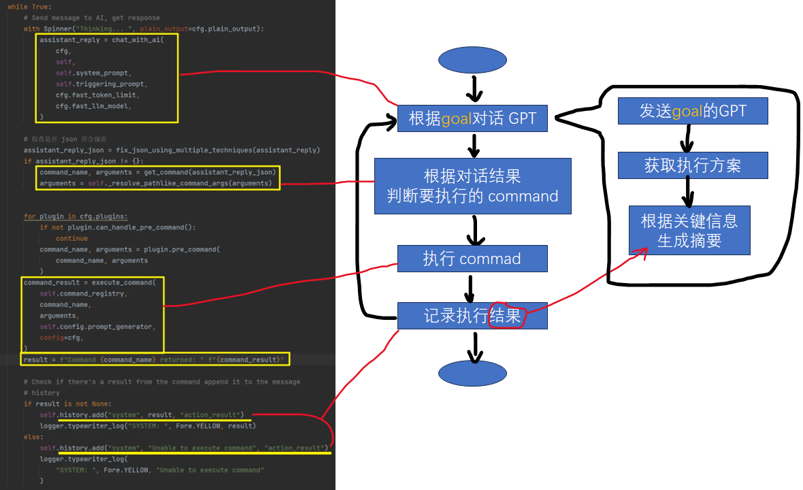
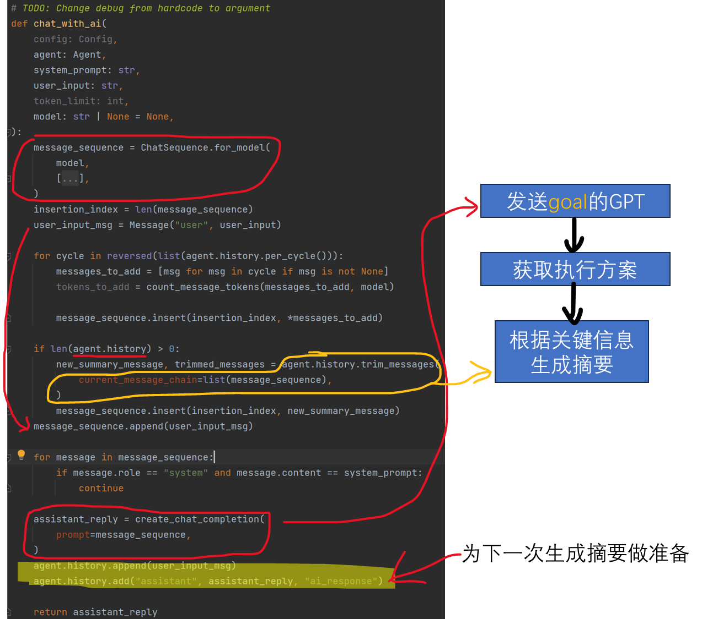
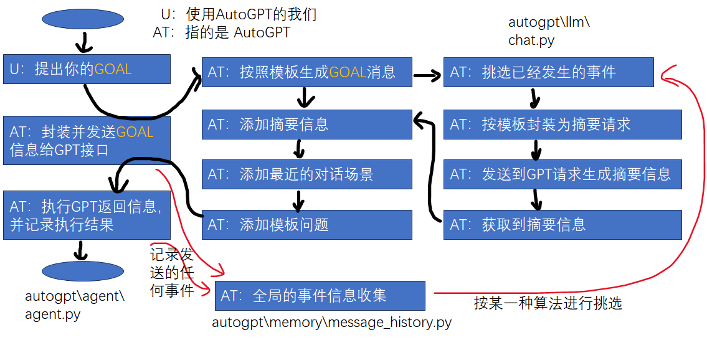

```python
class Agent:
    def start_interaction_loop(self):
        # Interaction Loop
        cfg = Config()
        self.cycle_count = 0
        command_name = None
        arguments = None
        user_input = ""

        # Signal handler for interrupting y -N
        def signal_handler(signum, frame):
            if self.next_action_count == 0:
                sys.exit()
            else:
                print(
                    Fore.RED
                    + "Interrupt signal received. Stopping continuous command execution."
                    + Style.RESET_ALL
                )
                self.next_action_count = 0

        signal.signal(signal.SIGINT, signal_handler)

        while True:
            # Send message to AI, get response
            with Spinner("Thinking... ", plain_output=cfg.plain_output):
                assistant_reply = chat_with_ai(
                    cfg,
                    self,
                    self.system_prompt,
                    self.triggering_prompt,
                    cfg.fast_token_limit,
                    cfg.fast_llm_model,
                )

            # 检查是否 json 符合规范
            assistant_reply_json = fix_json_using_multiple_techniques(assistant_reply)
            if assistant_reply_json != {}:
                command_name, arguments = get_command(assistant_reply_json)
                arguments = self._resolve_pathlike_command_args(arguments)


            for plugin in cfg.plugins:
                if not plugin.can_handle_pre_command():
                    continue
                command_name, arguments = plugin.pre_command(
                    command_name, arguments
                )
            command_result = execute_command(
                self.command_registry,
                command_name,
                arguments,
                self.config.prompt_generator,
                config=cfg,
            )
            result = f"Command {command_name} returned: " f"{command_result}"

            # Check if there's a result from the command append it to the message
            # history
            if result is not None:
                self.history.add("system", result, "action_result")
                logger.typewriter_log("SYSTEM: ", Fore.YELLOW, result)
            else:
                self.history.add("system", "Unable to execute command", "action_result")
                logger.typewriter_log(
                    "SYSTEM: ", Fore.YELLOW, "Unable to execute command"
                )
```

```python
# TODO: Change debug from hardcode to argument
def chat_with_ai(
    config: Config,
    agent: Agent,
    system_prompt: str,
    user_input: str,
    token_limit: int,
    model: str | None = None,
):
    message_sequence = ChatSequence.for_model(
        model,
        [
            Message("system", system_prompt),
            Message("system", f"The current time and date is {time.strftime('%c')}"),
        ],
    )
    insertion_index = len(message_sequence)
    user_input_msg = Message("user", user_input)

    for cycle in reversed(list(agent.history.per_cycle())):
        messages_to_add = [msg for msg in cycle if msg is not None]
        tokens_to_add = count_message_tokens(messages_to_add, model)

        message_sequence.insert(insertion_index, *messages_to_add)

    if len(agent.history) > 0:
        new_summary_message, trimmed_messages = agent.history.trim_messages(
            current_message_chain=list(message_sequence),
        )
        message_sequence.insert(insertion_index, new_summary_message)
    message_sequence.append(user_input_msg)

    for message in message_sequence:
        if message.role == "system" and message.content == system_prompt:
            continue

    assistant_reply = create_chat_completion(
        prompt=message_sequence,
    )
    agent.history.append(user_input_msg)
    agent.history.add("assistant", assistant_reply, "ai_response")

    return assistant_reply
```