速度极快的免费梯子，分享日期 2020年10月25日 如果时间过久可能会失效

## 安装流程

1. 下载[clash](https://wwa.lanzous.com/ijlojhq614j) 密码：ibas

2. 安装

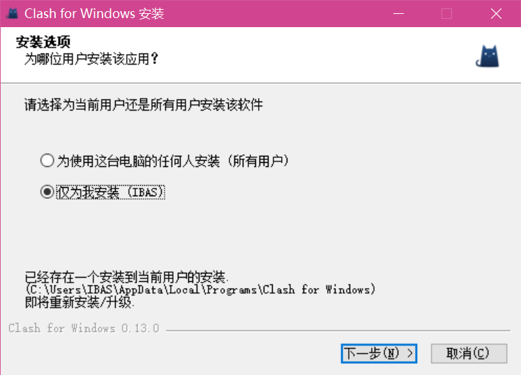

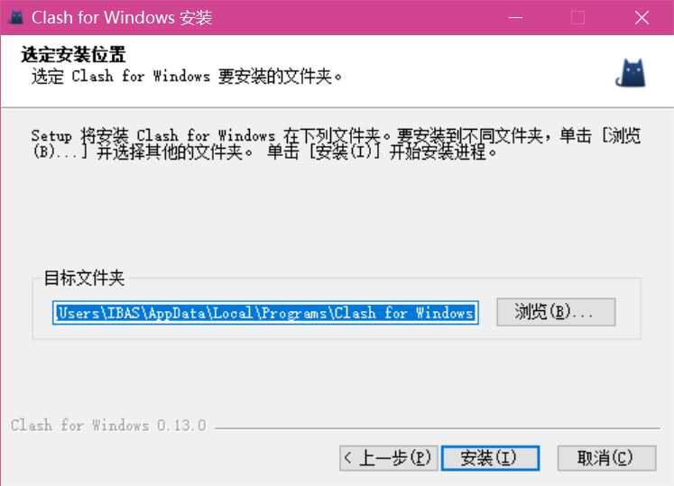

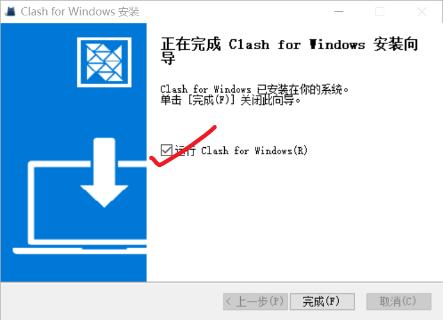

3. 安装完成点击 ```完成``` 按钮后，会在状态栏里面出现一个猫🐱的图案

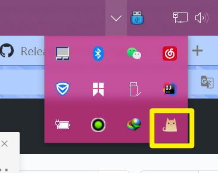

这时候表示安装完成

4. 请下载下面文件并解压到合理位置（我暂时解压到桌面，方便找到）

- 他是节点文件，如果发现文件不可用了，可以拉到最下面的 ```最新配置``` 下载最新的一个，我偶有更新

- ```最近一次编辑文档时间：2020年10月31日，顺带说明```：这里的配置文件中大部分节点已经过期，请拉到最下面下载最新的节点文件，并注意日期说明

[node1](http://www.sunibas.cn/pages/files/node1.zip)

5. 双击状态栏中的猫🐱

切换到 ```Profiles``` 中点击 ```import``` 按钮，导入刚刚保存的文件，并选中他

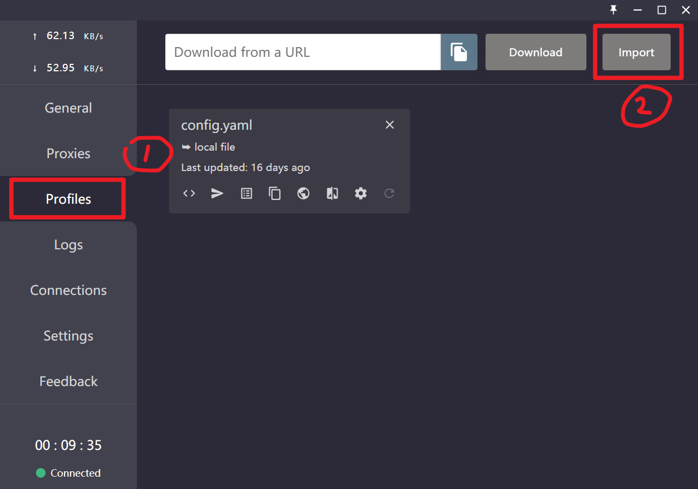

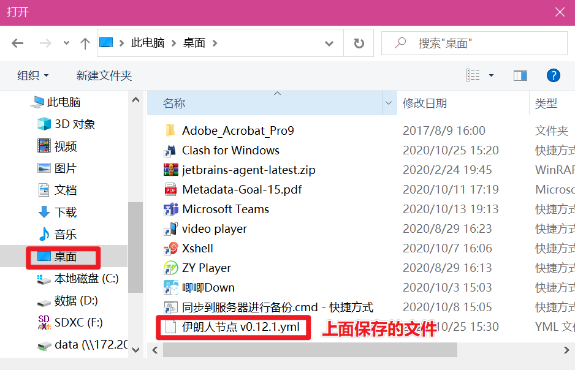

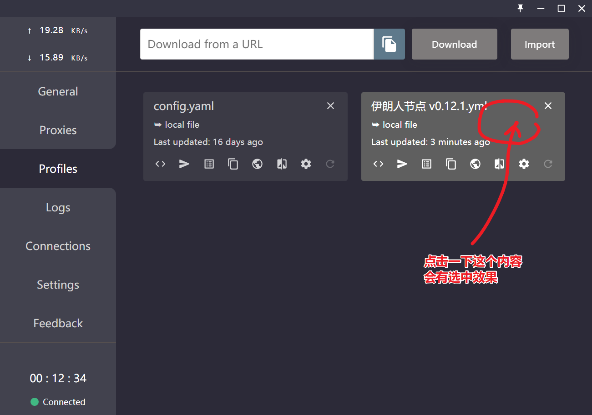

6. 开始使用

切换到 ```proxies``` 中，点击 ```节点选择``` 左边的 ```闪电⚡``` 按钮，直到自动选择框的右侧出现了一个 ```xxxms``` 表示可以了

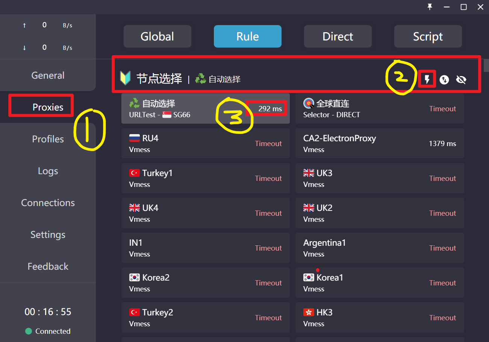

切换到 ```General``` 中，将 ```System Proxy``` 打开

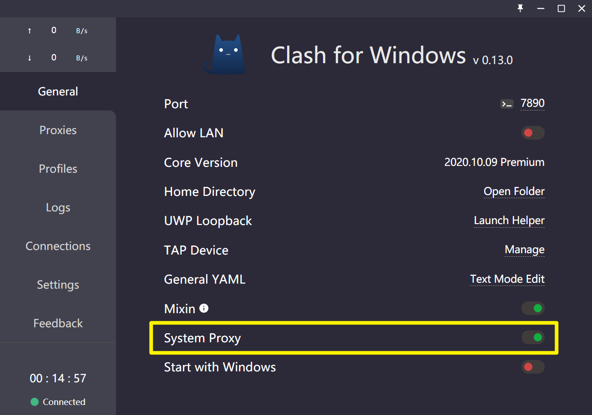

7. 到此就全部完成了，这时候打开 [YouTube](http://youtube.com/) 或 [Google](http://google.com/) 试一下

8. 汉化

汉化包在[这里](https://wwa.lanzous.com/iuJHOhq6vbg)，密码是:ibas

在任务栏中右键点击```任务管理器``` 或 同时按下 ```ctrl``` ```shift``` ```esc``` 可以打开任务管理器

打开文件所在位置，打开 ```resources``` 文件夹后，将补丁文件替换掉其中的 ```app.asar```

重启应用后就是中文的了，重启需要到 状态栏中将他关掉

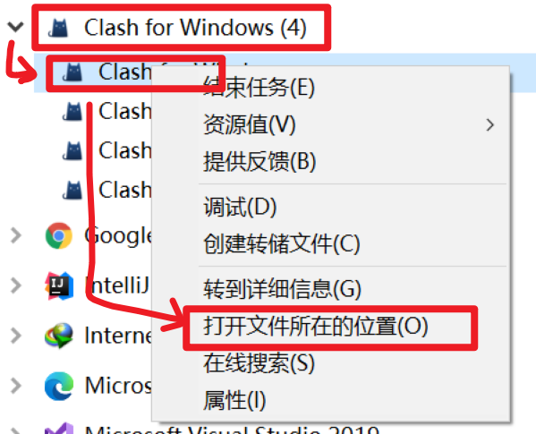

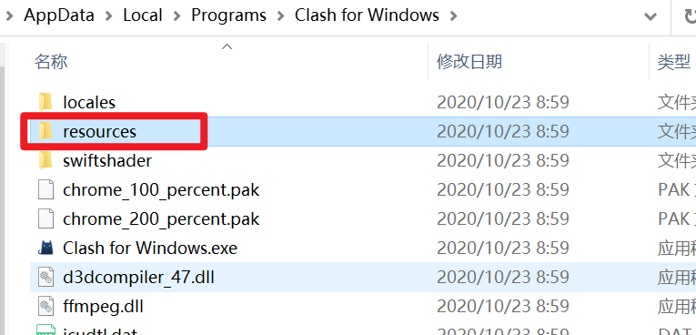

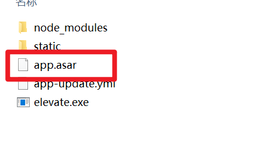

- 其他

[汉化补丁官方下载位置](https://github.com/BoyceLig/Clash_Chinese_Patch/releases/)

[clash应用下载位置](https://github.com/Fndroid/clash_for_windows_pkg/releases)

- 最新配置使用方法如下，点击下载后会出现一个```新的块```，后面的使用就如上面 ```5 及之后```的内容了

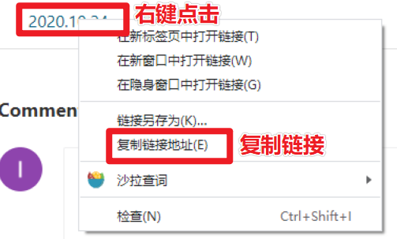

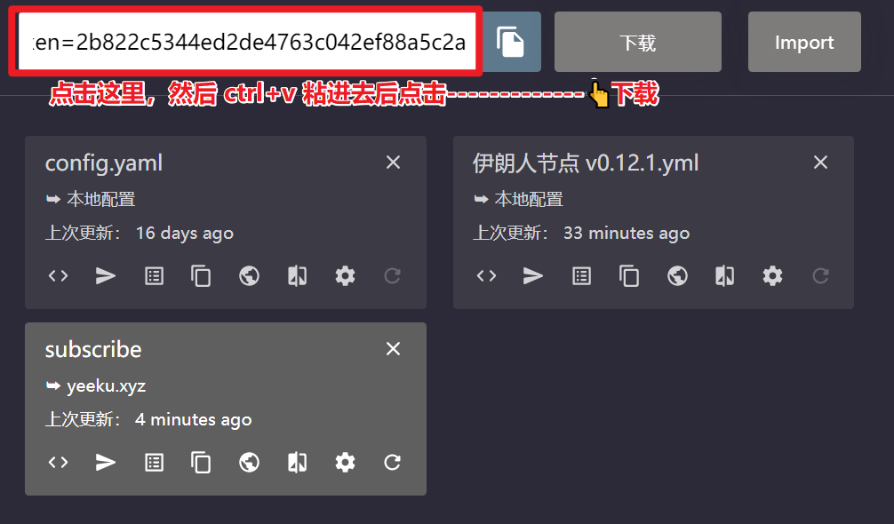


- 最新配置

[2020.10.27（亲测可用）~ 失效时间未知](http://www.sunibas.cn/pages/files/node3.zip)

[2020.10.30（亲测可用）~ 2020.11.12 失效（共980G）](http://www.sunibas.cn/pages/files/node4.zip)