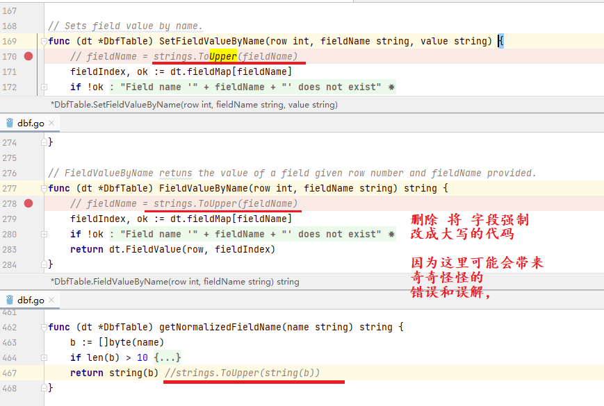
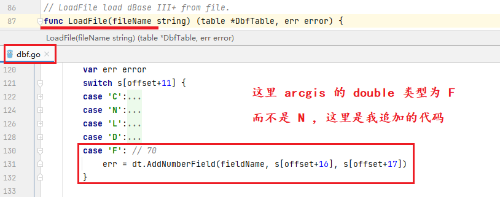
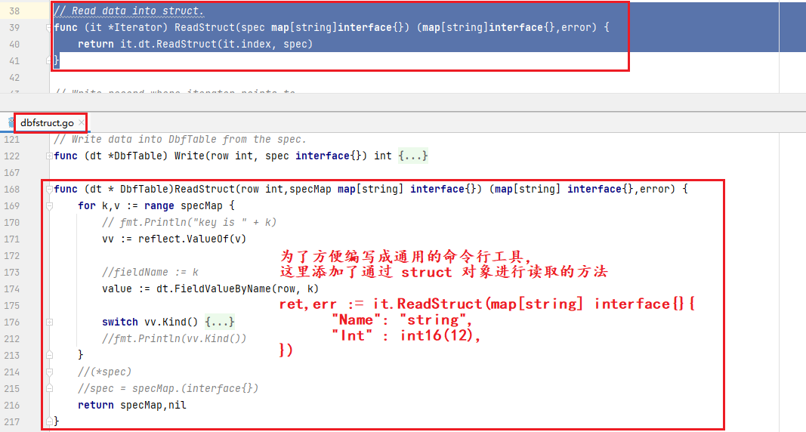
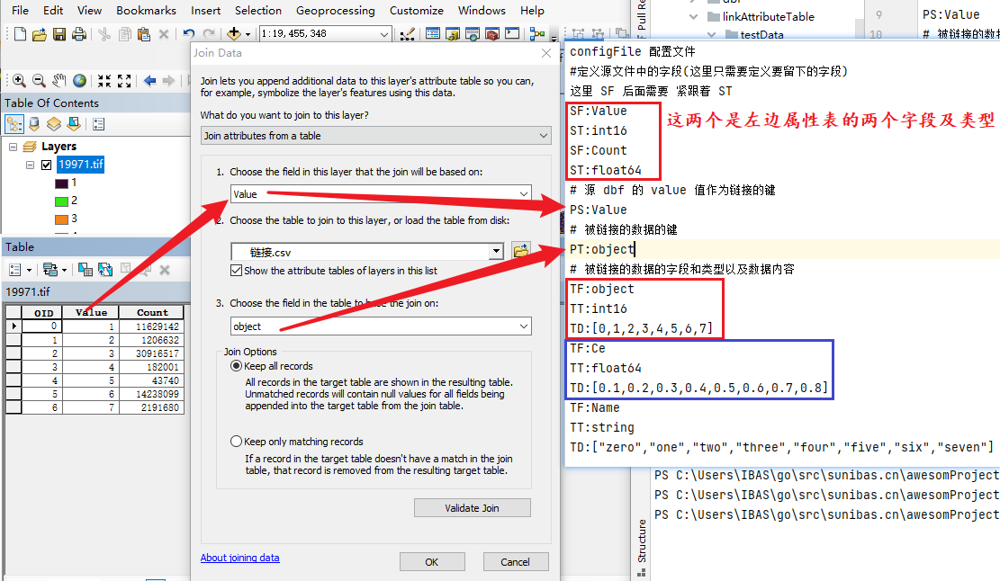
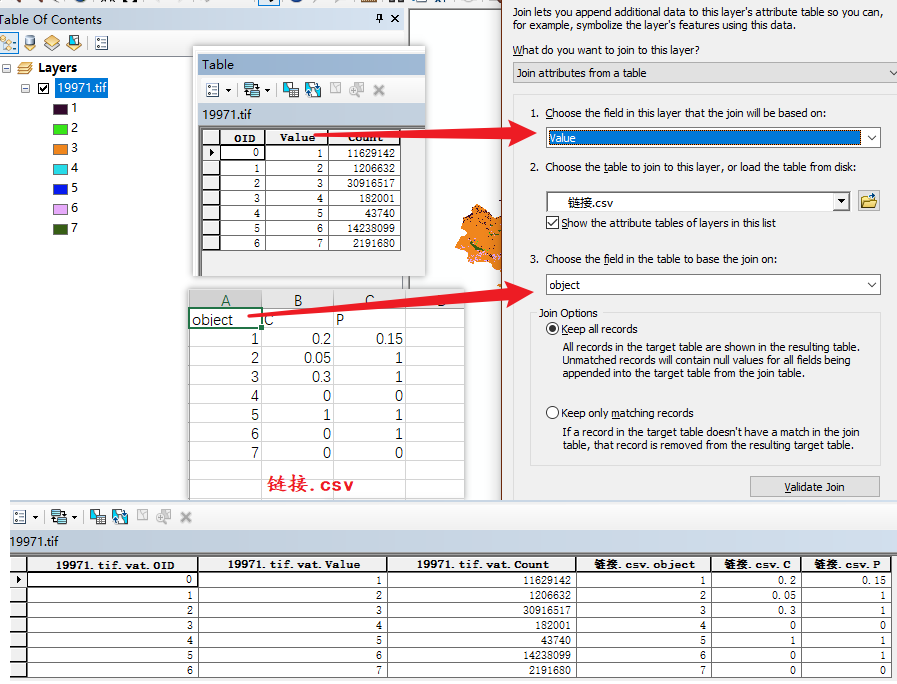

- 处理 dbf 文件

[DbfOp](./DbfOp.zip) 这个库来自于 [dbf](https://github.com/tadvi/dbf) 但是有已下

- [Field not all should be Upper.](https://github.com/tadvi/dbf/issues/1) (打包代码已修复)



- [The float number have not be dear with.](https://github.com/tadvi/dbf/issues/2) (打包代码已修复)



这里同时添加了通过 map 对象获取数据的方法




```go
package main

import (
	"strconv"
	"DbfOp"
)

type OldTable struct {
	Value int16
}

// 创建一个新的 dbf 文件，并在新的 dbf 文件中添加了两个字段 C 和 P
func main()  {
	newDbf := DbfOp.New()
	filename := "旧dbf路径.dbf"
	dbf,err := DbfOp.LoadFile(filename)
	if err != nil {
		panic(err)
	}
	newDbf.AddFloatField("Value")
	newDbf.AddFloatField("C")
	newDbf.AddFloatField("P")
	tb := OldTable{}
	c := 0
	iter := dbf.NewIterator()
	for iter.Next() {
		iter.Read(&tb)
		//fmt.Println(tb)
		row := newDbf.AddRecord()
		newDbf.SetFieldValueByName(row,"Value",strconv.Itoa(int(tb.Value)))
		newDbf.SetFieldValueByName(row,"C","123")
		newDbf.SetFieldValueByName(row,"P","123")
		c++
	}
	newDbf.SaveFile("新dbf的路径.dbf")
}
```

## 链接属性表

- 配置文件大概如下

```text
configFile 配置文件
#定义源文件中的字段(这里只需要定义要留下的字段)
这里 SF 后面需要 紧跟着 ST
SF:Value
ST:int16
SF:Count
ST:float64
# 源 dbf 的 value 值作为链接的键
PS:Value
# 被链接的数据的键
PT:object
# 被链接的数据的字段和类型以及数据内容
TF:object
TT:int16
TD:[0,1,2,3,4,5,6,7]
TF:Ce
TT:float64
TD:[0.1,0.2,0.3,0.4,0.5,0.6,0.7,0.8]
TF:Name
TT:string
TD:["zero","one","two","three","four","five","six","seven"]
```





- 源码

```go
package linkAttributeTable

import (
	"encoding/json"
	"fmt"
	"reflect"
	"strconv"
	"strings"
	"sunibas.cn/awesomProject/Utils/DbfOp"
	"sunibas.cn/awesomProject/Utils/FileOp"
)

type linkMap struct {
	sourceMap map[string] interface{}
	ps string
	pt string
	targetType []string
	targetMap map[string] []interface{}
	targetMapNames []string
	targetMapString map[string] []string
}

func compareValue(value1,value2 interface{}) bool {
	//if reflect.TypeOf(value1) == reflect.TypeOf(value2) {
	return value1 == value2
	//} else {
	//	panic("value type is different")
	//}
	//return false
}
func createTMData(typeName,data string) ([]interface{},[]string) {
	tn := strings.ToLower(typeName)
	switch tn {
	//case "int16":
	//	arr := []int16{}
	//	json.Unmarshal([]byte(data),&arr)
	//	ret := []interface{} {}
	//	str := []string{}
	//	for i := 0;i < len(arr);i++ {
	//		ret = append(ret,arr[i])
	//		str = append(str,strconv.Itoa(int(arr[i])))
	//	}
	//	return ret,str
	//case "int32":
	//	arr := []int32{}
	//	json.Unmarshal([]byte(data),&arr)
	//	ret := []interface{} {}
	//	str := []string{}
	//	for i := 0;i < len(arr);i++ {
	//		ret = append(ret,arr[i])
	//		str = append(str,strconv.Itoa(int(arr[i])))
	//	}
	//	return ret,str
	case "int64","int32","int16":
		arr := []int64{}
		json.Unmarshal([]byte(data),&arr)
		ret := []interface{} {}
		str := []string{}
		for i := 0;i < len(arr);i++ {
			ret = append(ret,arr[i])
			str = append(str,strconv.FormatInt(arr[i],10))
		}
		return ret,str
	case "string":
		arr := []string{}
		json.Unmarshal([]byte(data),&arr)
		ret := []interface{} {}
		for i := 0;i < len(arr);i++ {
			ret = append(ret,arr[i])
		}
		return ret,arr
	//case "float32":
	//	arr := []float32{}
	//	json.Unmarshal([]byte(data),&arr)
	//	ret := []interface{} {}
	//	str := []string{}
	//	for i := 0;i < len(arr);i++ {
	//		ret = append(ret,arr[i])
	//		str = append(str,strconv.FormatFloat(float64(arr[i]),'f',2,64))
	//	}
	//	return ret,str
	case "float64","float32":
		arr := []float64{}
		json.Unmarshal([]byte(data),&arr)
		ret := []interface{} {}
		str := []string{}
		for i := 0;i < len(arr);i++ {
			ret = append(ret,arr[i])
			str = append(str,strconv.FormatFloat(arr[i],'f',2,64))
		}
		return ret,str
	}
	return nil,nil
}
func createData(typeName string,arr bool) interface{} {
	tn := strings.ToLower(typeName)
	if arr {
		return []interface{}{
			createData(typeName,false),
		}
	}
	switch tn {
	case "int16":
		return int16(1)
	case "int32":
		return int32(1)
	case "int64":
		return int64(1)
	case "string":
		return ""
	case "float32":
		return float32(1)
	case "float64":
		return float64(1)
	}
	return tn
}
func buildLinkMap(configFile string) (lm linkMap) {
	lm = linkMap{
		sourceMap: map[string]interface{}{},
		targetMap: map[string][]interface{}{},
		targetMapString: map[string][]string{},
		targetMapNames: []string{},
		targetType: []string{},
		ps: "",
		pt: "",
	}
	lines := strings.Split(FileOp.ReadAll(configFile),"\r\n")
	linesLen := len(lines)
	for i := 0;i < linesLen;i++ {
		line := strings.TrimSpace(lines[i])
		if len(line) < 4 {
			continue
		}
		switch line[:3] {
		case "SF:":
			ST := strings.TrimSpace(strings.TrimSpace(lines[i + 1])[3:])
			SF := strings.TrimSpace(line[3:])
			lm.sourceMap[SF] = createData(ST,false)
			i++
			break
		case "PS:":
			lm.ps = strings.TrimSpace(line[3:])
			break
		case "PT:":
			lm.pt = strings.TrimSpace(line[3:])
			break
		case "TF:":
			TF := strings.TrimSpace(line[3:])
			TT := strings.ToLower(strings.TrimSpace(strings.TrimSpace(lines[i + 1])[3:]))
			TD := strings.TrimSpace(strings.TrimSpace(lines[i + 2])[3:])
			lm.targetMap[TF],lm.targetMapString[TF] = createTMData(TT,TD)
			lm.targetMapNames = append(lm.targetMapNames,TF)
			lm.targetType = append(lm.targetType,TT)
			i += 2
		}
	}
	if lm.ps != "" && lm.pt != "" {
		if _,ok := lm.sourceMap[lm.ps];
		!ok {
			fmt.Println("ps can not be found in SF")
		}
		if _,ok := lm.targetMap[lm.pt];
		!ok {
			fmt.Println("pt can not be found in TF")
		}
	} else {
		panic("ps & pt can not be found")
	}
	return
}

// 链接属性表
// configFile 配置文件
// #定义源文件中的字段(这里只需要定义要留下的字段)
// 这里 SF 后面需要 紧跟着 ST
// SF:Value
// ST:int16
// # 源 dbf 的 value 值作为链接的键
// PS:Value
// # 被链接的数据的键
// PT:object
// # 被链接的数据的字段和类型以及数据内容
// TF:object
// TT:int16
// TD:[12,13,14,15]
// TF:C
// TT:float64
// TD:[12.1,12.2,12.3]
// TF:Name
// TT:string
// TD:["ibas","bing","go"]
func LinkAttributeTable(dbfFile string,outDirFile string,configFile string) {
	lm := buildLinkMap(configFile)
	fmt.Println(lm)
	dbf, err := DbfOp.LoadFile(dbfFile)
	if err != nil {
		panic(err)
	}
	newDbf := DbfOp.New()

	addInt16 := func(row int, fileName string, value int16) {
		newDbf.SetFieldValueByName(row, fileName, strconv.Itoa(int(value)))
	}
	addInt32 := func(row int, fileName string, value int32) {
		newDbf.SetFieldValueByName(row, fileName, strconv.Itoa(int(value)))
	}
	addInt64 := func(row int, fileName string, value int64) {
		newDbf.SetFieldValueByName(row, fileName, strconv.FormatInt(value, 10))
	}
	addFloat := func(row int, fileName string, value float64) {
		newDbf.SetFieldValueByName(row, fileName, strconv.FormatFloat(value, 'f', 2, 64))
	}

	iter := dbf.NewIterator()
	tb := map[string]interface{}{}
	ptLen := len(lm.targetMap[lm.pt])
	tFieldLen := len(lm.targetMapNames)
	for i := 0; i < tFieldLen; i++ {
		switch lm.targetType[i] {
		case "int16", "int32", "int64":
			newDbf.AddIntField(lm.targetMapNames[i])
			break
		case "float32", "float64":
			newDbf.AddFloatField(lm.targetMapNames[i])
			break
		case "string":
			newDbf.AddTextField(lm.targetMapNames[i], 123)
			break
		}
	}
	for k, v := range lm.sourceMap {
		vv := reflect.ValueOf(v)
		switch vv.Kind() {
		case reflect.Int64, reflect.Int32, reflect.Int16, reflect.Int:
			newDbf.AddIntField(k)
			break
		case reflect.String:
			newDbf.AddTextField(k, 128)
			break
		case reflect.Float64, reflect.Float32:
			newDbf.AddFloatField(k)
			break
		}
	}
	for iter.Next() {
		tb, err = iter.ReadStruct(lm.sourceMap)
		row := newDbf.AddRecord()
		for k, v := range tb {
			vv := reflect.ValueOf(v)
			switch vv.Kind() {
			case reflect.Int16:
				addInt16(row, k, v.(int16))
				break
			case reflect.Int32:
				addInt32(row, k, v.(int32))
				break
			case reflect.Int64:
				addInt64(row, k, v.(int64))
				break
			case reflect.String:
				newDbf.SetFieldValueByName(row, k, v.(string))
				break
			case reflect.Float64:
				addFloat(row, k, v.(float64))
				break
			case reflect.Float32:
				addFloat(row, k, float64(v.(float32)))
				break
			}
		}
		sf := tb[lm.ps]
		for i := 0; i < ptLen; i++ {
			if lm.targetMap[lm.pt][i] == sf {
				for j := 0; j < tFieldLen; j++ {
					newDbf.SetFieldValueByName(row, lm.targetMapNames[j], lm.targetMapString[lm.targetMapNames[j]][i])
				}
				break
			}
		}
	}
	newDbf.SaveFile(outDirFile)
}
```