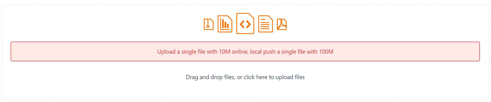

### 简易 sql 服务

[视频例子](https://www.bilibili.com/video/BV1XS4y187gf/)

编写这个软件的目的就是为了提供一个最为简单的方式```快速```创建一个数据库服务，并且```不需要额外安装```任何的软件或服务，虽然缺点是 sql 暴露，但是这仅仅是个人局域网使用，何必去考虑呢？

例如，爬取疫情数据，并将数据放置到数据库时不容易共享给非局域网内的其他用户

例如，爬取股票数据，每日 4K+ 个股票交易信息不管是横向或纵向更新都是一件不容易的事情，同时数据还要同时同步到云盘

例如，使用油猴软件编写爬虫软件，但是没有一个可靠的云端数据库时，可以将数据保存到本地，同时也可以在多个非局域网内的主机中将爬虫任务进行拆分

例如，....

- 另外，测试了一下，execute 模式执行速度比 navicat 更快，但是需要你 sql 是正确且可靠的

[下载](./simpledb.zip)，因为无法上次大于 10M 的文件，由不想用 git 进行上传，因此只能压缩后上传，只打包了 ```windows``` 版本



- 自动链接或创建一个数据库

### 使用 simpledb.exe

```text
simpledb.exe --config=配置文件  --mode=模式  --execute=指定内容  --info

simpledb.exe --config=a.json -mode=web --info
simpledb.exe --config=a.json -mode=execute --execute=write_tb --info
```

| 字段 | 说明 |
| -------- | -------- |
| --config  | ```必须``` 配置文件（可以是相对路径）  |
| --mode | ```必须``` web/execute 两种模式，web 模式是开启一个服务，execute 模式是直接执行 execute 指定的 api |
| --execute | 仅在 execute 模式下有效```且必须``` |
| --info |  ```可选```显示执行信息，这里其实有点混乱，还没弄好，但是不影响使用 |

#### 配置文件的编写规则如下

- 配置字段说明

| 字段 | 说明 |
| -------- | -------- |
| prot  | web 服务端口  |
| db_path | 数据库位置，可以是相对（执行文件）路径 |
| static_path | 静态资源路径 |
| static_url |  静态资源访问路径 |
| others | 忽略内容 |
| sqls | 初始化 sql |
| apis | 接口（web 接口或 执行 接口） |

- apis 字段说明

| 字段 | 说明 |
| -------- | -------- |
| name | api 名称 |
| return | ```数组```执行 sql 之后的返回内容 |
| param | ```数组```执行 sql 时用到的参数 |
| sql | 要执行的 sql ，其中的 {xx} 将被 param 中的 xx 内容所覆盖 |
| desc | 描述（暂时忽略） |

#### 下面 web api 说明

假设数据库内容如下

| id | value (char(5)) | time (integer) |
| -------- | -------- | -------- |
| 0 | 1 | 1 |
| 1 | 1 | 2 |
| 2 | 2 | 1 |
| 3 | 1 | 2 |

要完成的 sql 为 ```select * from record where time="1" and value=2```

那么 ```param = ["1","2"]```

```return = [["1","1","2"],["3","1","2"]]```

```json
{
  "name": "queryRecordByTimeAndValue",
  "return": [
    "id",
    "value",
    "time"
  ],
  "param": [ "time","value" ],
  "sql": "select * from record where time=\"{time}\" and value={value}",
  "desc": "这里的 time 和 value 什么时候加 双引号，可以自己执行一次 sql 后决定(拷贝sql)"
}
```

#### 执行接口和 web 接口区别

1. ```name``` 必须有 ```write_```  ```execute_``` 三种开头，分别表示 写出、仅执行
2. param 对于 仅执行，格式为 ["文件","行内分隔符","提交sql数量(默认是100)","用于删除拼接sql时多余的部分，并替换成,"]，对于 写出，格式为 ["文件","模板"]
3. return 表示输出，只对 写出 有效，表示执行 sql 后的返回内容

- param 在 ```仅执行``` 中的 第四个参数是一个特例，仅适合 输入文件为 ```insert into tableName(xxx) values(xxx);``` 格式时适用

```sql
--- params[4] = ";insert into table1(id,name) values" ==> ','
insert into table1(id,name) values(1,"a");
insert into table1(id,name) values(2,"b");
insert into table1(id,name) values(3,"c");
insert into table1(id,name) values(4,"d");
--- 最终将生成
--- insert into table1(id,name) values(1,"a"),(2,"b"),(3,"c"),(4,"d");
```

例子如下

```json
{
  "name": "write_tb1",
  "return": [
    "id",
    "value",
    "time"
  ],
  "return_desc": "表示 sql 执行完成后的返回值，并且这个值将是数组的顺序，用于替换 模板内容",
  "param": [
    "xxx.sql",
    "insert into record(id,value,time) values({0},{1},{2})"
  ],
  "sql": "select id,value,time from record where time=\"{time}\" and value={value}",
  "desc": "这里的 time 和 value 什么时候加 双引号，可以自己执行一次 sql 后决定(拷贝sql)"
}
```

```json
{
  "name": "execute_tb1",
  "return": [
  ],
  "param": [
    "xxx.sql",
    "",
    "100",
    ";insert into table1(id,name) values"
  ],
  "parma_desc": [
    "",
    "表示不对内容进行分割"
  ],
  "sql": "{0}",
  "sql_desc": "由于没有分割，因此直接以行为单位执行了整个文件",
  "desc": "sql 由 param[1] 生成"
}
```

## 一个完整的示例

- 下面测试样例中的所有 desc 结尾的内容都是无关紧要的，可以删除，只是一种字段描述而已

```shell
# 启动脚本
simpledb.exe --mode=web --config=config.json
```

- 一共四个 api ```execute_record```、```write_record```、```insertRecord```、```queryRecordByValue```

| api | 说明 |
| -------- | -------- |
| execute_record | 执行 sql |
| write_record | 执行 sql 并将 sql 结果写出 |
| insertRecord | 插入一个 ```记录项``` |
| queryRecordByValue | 根据 ```value``` 获取记录项 |

```json
{
  "port": ":8099",
  "port_desc": "端口",
  "db_path": "test.db",
  "db_path_desc": "数据库位置（相对位置时表示程序所在位置），可以另外由 --dbpath 参数指定",
  "static_path": "./",
  "static_path_desc": "(html位置)",
  "static_url": "/views/",
  "static_url_desc": "(html 访问链接)",
  "others": [
    "这里是无关紧要的内容(可删除的说明内容)",
    "数据库表说明",
    " id : symbol + timeStamp, symbol,time : 当日的时间戳,timeStamp : 单条记录的时间戳,amount : 该时间点交易量",
    "percent : 涨跌幅, chg : 涨跌额, avg_price : 平均价格, volume : 量, current : 当前价格"
  ],
  "sqls_desc": "(一般是创建表sql，或初始化数据库sql)",
  "sqls": [
    "create table if not exists record(id char(30) primary key not null,value integer not null,time char(20) not null);"
  ],
  "api_desc": "api 集合，但是这里有联众 api，一种是用于 web 服务的接口 api ，一种是用于写入写出文件的 api，格式见上面，例子见下面",
  "apis": [
    {
      "name": "write_record",
      "name_desc": "写出数据到 文件",
      "return": [
        "id",
        "value",
        "time"
      ],
      "param": [
        "D:\\Temp\\test\\out.json",
        "insert into record(id,value,time) values(\"{0}\",{1},\"{2}\");\r\n"
      ],
      "sql": "select * from record;",
      "desc": "将表 record 中的所有内容写到文件 param[0] 指定的位置，格式为 [[一条记录],[一条记录],[一条记录]]"
    },
    {
      "name": "execute_record",
      "name_desc": "写出数据到 文件 ",
      "return": [],
      "param": [
        "xxx.sql",
        "",
        "100",
        ";insert into table1(id,name) values"
      ],
      "parma_desc": [
        "",
        "表示不对内容进行分割"
      ],
      "sql": "{0}",
      "sql_desc": "由于没有分割，因此直接以行为单位执行了整个文件",
      "desc": "sql 直接由 param[1] 生成"
    },
    
    
    {
      "name": "getTables",
      "name_desc": "一般的 web 接口 api ，这是默认接口，即便不写软件内部也会自动追加",
      "return": [
        "name"
      ],
      "param": [],
      "sql": "select name from sqlite_master where type=\"table\" order by name;",
      "desc": "-apis 获取所有的表名"
    },
    {
      "name": "insertRecord",
      "return": [],
      "param": [
        "id",
        "value",
        "time"
      ],
      "sql": "insert or ignore into record(id,value,time) values(\"{id}\",{value},\"{time}\");",
      "desc": "-apis 插入一个记录项（检查唯一值，但是实际上也可以不用）"
    },
    {
      "name": "queryRecordByValue",
      "return": [
        "id",
        "value",
        "time"
      ],
      "param": [
        "value"
      ],
      "sql": "select id,value,time from record where value={value};",
      "desc": "-apis 通过 value 的值查询对应的记录项"
    }
  ]
}
```

#### 浏览器端调用接口

```javascript
const apis = {
    apiUrl: "http://localhost:8099/api",
    post(method,params) {
        params = params || [];
        return fetch(apis.apiUrl, {
            method: 'post',
            body: JSON.stringify({
                Method: method,
                Params: params.map(_ => `${_}`)
            })
        });
    },
    getTables() {
        return apis.post("getTables").then(JSON.parse).then(console.log);
    },
    insertRecord(id,value,time) {
        return apis.post("insertRecord",[id,value,time]);
    },
    queryRecordByValue(value) {
        return apis.post("queryRecordByValue",[value]);
    }
};
```

#### nodejs 调用方法如下（应该是正常的，因为我没测试）

```javascript
const https = require("https");
const http = require('http');
const URL = require('url');
const qs = require("querystring");

/**
 * @return Promise
 * */
const post = function (url,option,data) {
    reqMethod = http.request.bind(http);
    let link = URL.parse(url);
    let opt = {
        hostname: link.hostname,
        path: link.path,
        method: 'post',
        port: link.port,
        ...(option || {})
    };
    return new Promise(function (s,f) {
        let req = reqMethod(opt,function (res) {
            let datas = '';
            res.setEncoding('utf8');
            res.on('data', function (chunk) {
                datas += chunk;
            });
            res.on('end',function () {
                s(datas);
            });
            res.on('error',function (err) {
                f(err);
            });
        });
        if (data) {
            let reqStr = data;
            if (typeof data === 'object') {
                reqStr = JSON.stringify(data);
            }
            opt.headers = {
                ...(opt.headers || {}),
                'Content-Length': Buffer.byteLength(reqStr)
            };
            req.write(reqStr);
        }
        req.end();
        req.on('error',f);
    });
};

const apis = {
    apiUrl: "http://localhost:8089/api",
    post(method, param) {
        // 执行结果等同下面代码
        // fetch('http://localhost:8089/api',{
        //     method: 'post',
        //     body: JSON.stringify({
        //         Method: method,
        //         Params: param
        //     })
        // }).then(_=>_.text())
        console.log(`method = ${method} & param = ${param ? param.join(',') : ''}`)
        return post(apis.apiUrl, {
            headers: {
                'Content-Type': 'application/json',
            }
        }, {
            method: method,
            // params: [l.id,l.text,l.right],
            params: param,
        }).then();
    },
    getTables() {
        return apis.post("getTables").then(JSON.parse).then(console.log);
    },
    insertRecord(id,value,time) {
        return apis.post("insertRecord",[id,value,time]);
    },
    queryRecordByValue(value) {
        return apis.post("queryRecordByValue",[value]);
    }
}
```

