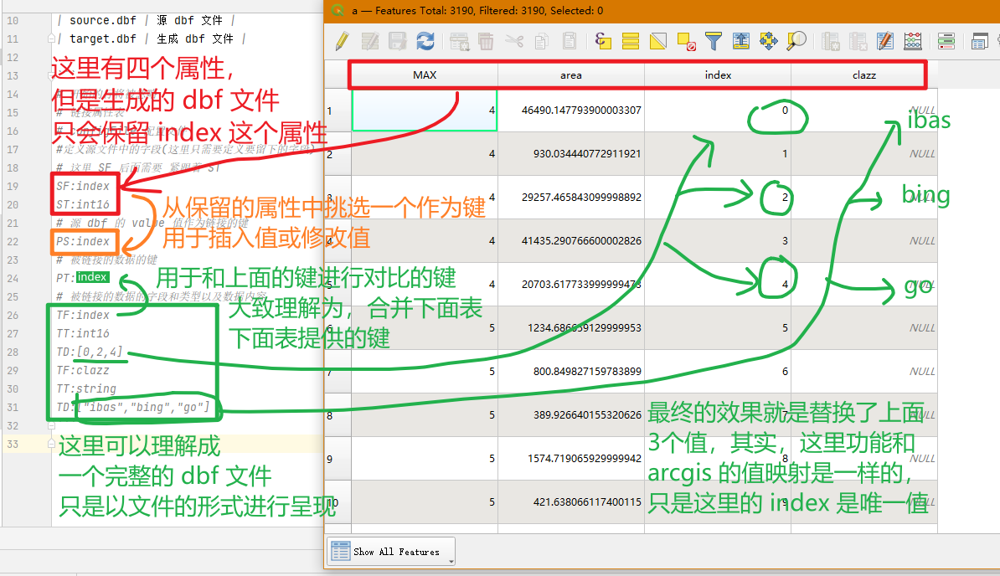

# dbf 工具

### 链接属性表

> xxx.exe link xxx.txt source.dbf target.dbf

| 部分 | 解释 |
| -------- | -------- |
| xxx.txt | 链接文件（见下方例子） |
| source.dbf | 源 dbf 文件 |
| target.dbf | 生成 dbf 文件 |

- ▲：这里的 TF 会优先用于替换 SF 的内容（数据格式）

- 数据类型：```int16``` ```int32``` ```int64``` ```float32``` ```float64``` ```string```




```
# 任意不是 SF\ST\PS\PT\TF 开始的内容将自动被忽略
# 链接属性表
# configFile 配置文件
#定义源文件中的字段(这里只需要定义要留下的字段)
# 这里 SF 后面需要 紧跟着 ST
SF:index
ST:int16
# 源 dbf 的 value 值作为链接的键
PS:index
# 被链接的数据的键
PT:clazz
# 被链接的数据的字段和类型以及数据内容
TF:index
TT:int16
TD:[0,2,4]
# 这里每个 TF TT TD 都要紧跟着定义，且顺序一定是 TF TT TD
TF:clazz
TT:string
TD:["ibas","bing","go"]
```
