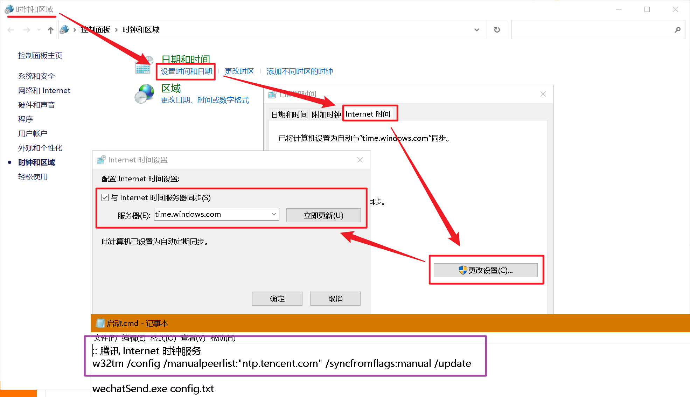

### 微信定时发送信息


1. 设置时区

```bash
:: 腾讯 Internet 时钟服务
w32tm /config /manualpeerlist:"ntp.tencent.com" /syncfromflags:manual /update
```



2. 修改配置文件 (config.json)

| 字段 | 说明 |
|:--:|:--:|
| Greed | 称呼(数组，将随机选中一个用于发送) |
| DelayTime | 延时(毫秒，正表示提前发送，负表示延迟发送) |
| SendTimeHour:SendTimeMinus:SendTimeSecond | 发送的时分秒 |
| Title | 微信名(见下图) |
| DayStrings | 发送内容 |

DayStrings
| 字段 | 说明 |
|:--:|:--:|
| Date | 1~7 表示 周一到周日 |
| Content | 发送内容(数组，将随机选中一个用于发送) |

设置配置文件的 title 字段


3. 启动软件


▲ 1. 最好不要有中文路径

▲ 2. 将联系人单独拉出来

▲ 3. 不能锁屏

- 下面是参考配置

```json
{
  "Greed": [
    "你好，李师傅，",
    "你好，师傅，",
    "您好，李老师，",
    "您好，老师，"
  ],
  "DelayTime": 100,
  "SendTimeHour": 20,
  "SendTimeMinus": 50,
  "SendTimeSecond": 0,
  "Title": "1234",
  "DayStrings": [
    {
      "Date": 6,
      "Content": [
        "我想订周一20-21点的羽毛球",
        "我想订周一21-22点的羽毛球",
        "我想订周一的羽毛球，21-22点",
        "我想订周一的羽毛球，20-21点"
      ]
    },
    {
      "Date": 7,
      "Content": [
        "我想订周二20-21点的羽毛球",
        "我想订周二21-22点的羽毛球",
        "我想订周二的羽毛球，21-22点",
        "我想订周二的羽毛球，20-21点"
      ]
    },
    {
      "Date": 1,
      "Content": [
        "我想订周三20-21点的羽毛球",
        "我想订周三21-22点的羽毛球",
        "我想订周三的羽毛球，21-22点",
        "我想订周三的羽毛球，20-21点"
      ]
    },
    {
      "Date": 2,
      "Content": [
        "我想订周四20-21点的羽毛球",
        "我想订周四21-22点的羽毛球",
        "我想订周四的羽毛球，21-22点",
        "我想订周四的羽毛球，20-21点"
      ]
    },
    {
      "Date": 3,
      "Content": [
        "我想订周五20-21点的羽毛球",
        "我想订周五21-22点的羽毛球",
        "我想订周五的羽毛球，21-22点",
        "我想订周五的羽毛球，20-21点"
      ]
    },
    {
      "Date": 4,
      "Content": [
        "我想订周六19-21点的羽毛球",
        "我想订周六晚上7~9点的羽毛球"
      ]
    },
    {
      "Date": 5,
      "Content": [
        "我想订周日15-17点的羽毛球",
        "我想订周日下午3~5点的羽毛球",
        "我想订周日21-22点的羽毛球",
        "我想订周日晚上8~10点的羽毛球"
      ]
    }
  ]
}
```

### 源码(go)

```go
package main

import (
	"fmt"
	"github.com/go-vgo/robotgo"
	"github.com/go-vgo/robotgo/clipboard"
	"os"
	"strconv"
	"strings"
	"sunibas.cn/awesomProject/Utils/FileOp"
	"sunibas.cn/awesomProject/Utils/window"
	"sunibas.cn/awesomProject/WechatSendMsg/Configure"
)

var hwd window.Window
var configure Configure.Configure

func main()  {
	m := window.GetAllWindows()
	if len(os.Args) == 2 {
		//configure = Configure.LoadConfig("C:\\Users\\IBAS\\go\\src\\sunibas.cn\\awesomProject\\WechatSendMsg\\config.json")
		configure = Configure.LoadConfig(os.Args[1])
		go updateTime()
		//fmt.Println(configure)
		for handle := range m {
			if m[handle].Title() == configure.Title {
				hwd = m[handle]
				readyForSend()
			}
		}
	} else {
		titles := []string{}
		fmt.Println("所有窗口标题(Title)如下")
		ntf := "||| no title found |||"
		for handle := range m {
			t := m[handle].Title()
			if t != ntf {
				fmt.Println(t)
				titles = append(titles,t)
			}
		}
		FileOp.WriteWithIOUtilByte("titles.txt",[]byte(strings.Join(titles,"\r\n")))
	}
}

const sleepTime = 60
func readyForSend()  {
	fmt.Println("找到窗口，准备发送信息")
	waitForSend := false
	for {
		lt,tStr := configure.GetTargetTime()
		if lt < 0 {
			fmt.Println("[" + tStr + "] : 今天已经结束")
		} else {
			fmt.Println("[" + tStr + "] : 还有 " + strconv.Itoa(int(lt)) + " 毫秒")
			if lt < waitTime * 2 + delayTs {
				// 准备发送信息了
				waitForSend = true
				fmt.Println("即将发送信息")
				waitForSendMsg()
			}
		}
		if waitForSend {
			// 等待发送过程钟等待 5 分钟不进行检测
			robotgo.Sleep(sleepTime * 5)
			waitForSend = false
		} else {
			robotgo.Sleep(sleepTime)
		}
	}
}

// 延时时间戳
const delayTs = int64(1.8 * 100)
// 等待 60 秒后发送信息
const waitTime = int64(sleepTime * 1000)
func waitForSendMsg()  {
	w := configure.GetWord()
	lt,_ := configure.GetTargetTime()
	lt -= delayTs
	robotgo.MicroSleep(float64(lt))
	//time.Sleep(time.Duration(lt))
	hwd.Force()
	//robotgo.c
	clipboard.WriteAll(w)
	robotgo.MilliSleep(100);
	robotgo.KeyTap("v","ctrl")
	//robotgo.TypeStr("文件传输助手-go go go")
	robotgo.MilliSleep(100);
	robotgo.KeyTap("enter")
	fmt.Println("发送完成")
	_,ts := configure.GetTargetTime()
	fmt.Println("发送时间：" + ts)
}

func updateTime() {

}

```

- FileOp

```go
package FileOp

import "io/ioutil"

func WriteWithIOUtilByte(name string, data []byte) {
	if ioutil.WriteFile(name, data, 0644) == nil {
		//fmt.Println("写入文件成功:")
	}
}
```

- window

```go
package window

import (
	"syscall"
	"unsafe"
)

// https://github.com/gonutz/w32/blob/main/functions.go
var (
	user32dll          			  = syscall.MustLoadDLL("user32.dll")
	procEnumWindows    			  = user32dll.MustFindProc("EnumWindows")
	procGetWindowTextW 			  = user32dll.MustFindProc("GetWindowTextW")
	procGetWindowRect 			  = user32dll.MustFindProc("GetWindowRect")
	showWindowAsync               = user32.NewProc("ShowWindowAsync")
	SetActiveWindow               = user32.NewProc("SetActiveWindow")
	setForegroundWindow           = user32.NewProc("SetForegroundWindow")
)

// Window represents any Window that is opened in the Windows OS
type Window struct {
	handle syscall.Handle
	title  string
}

// Title returns the title of the window
func (w Window) Title() string {
	return w.title
}
func (w Window)Force() {
	SetActiveWindow.Call(uintptr(w.handle))
	showWindowAsync.Call(uintptr(w.handle),uintptr(1))
	setForegroundWindow.Call(uintptr(w.handle))
}

// GetAllWindows finds all currently opened windows
func GetAllWindows() map[syscall.Handle]Window {
	m := make(map[syscall.Handle]Window)
	cb := syscall.NewCallback(func(h syscall.Handle, p uintptr) uintptr {
		bytes := make([]uint16, 200)
		_, err := GetWindowText(h, &bytes[0], int32(len(bytes)))
		title := "||| no title found |||"
		if err == nil {
			title = syscall.UTF16ToString(bytes)
		}
		m[h] = Window{h, title}
		return 1 // continue enumeration
	})
	EnumWindows(cb, 0)
	return m
}

// EnumWindows loops through all windows and calls a callback function on each
func EnumWindows(enumFunc uintptr, lparam uintptr) (err error) {
	r1, _, e1 := syscall.Syscall(procEnumWindows.Addr(), 2, uintptr(enumFunc), uintptr(lparam), 0)
	if r1 == 0 {
		if e1 != 0 {
			err = error(e1)
		} else {
			err = syscall.EINVAL
		}
	}
	return
}

// GetWindowText gets the title of a Window given by a certain handle
func GetWindowText(hwnd syscall.Handle, str *uint16, maxCount int32) (len int32, err error) {
	r0, _, e1 := syscall.Syscall(procGetWindowTextW.Addr(), 3, uintptr(hwnd), uintptr(unsafe.Pointer(str)), uintptr(maxCount))
	len = int32(r0)
	if len == 0 {
		if e1 != 0 {
			err = error(e1)
		} else {
			err = syscall.EINVAL
		}
	}
	return
}

type RECT struct {
	Left   int32 // or Left, Top, etc. if this type is to be exported
	Top    int32
	Right  int32
	Bottom int32
}
func GetWindowRect(hwnd syscall.Handle) RECT {
	rect := RECT{}
	syscall.Syscall(procGetWindowRect.Addr(), 3, uintptr(hwnd), uintptr(unsafe.Pointer(&rect)), 0)
	return rect
}
```

- config

```go
package Configure

import (
	"encoding/json"
	"fmt"
	"io/ioutil"
	"math/rand"
	"strconv"
	"time"
)

type DayString struct {
	Date int // 1~7 表示 周一到周日
	Content []string // 发送的内容（数组随机选）
}

type Configure struct {
	Greed []string
	SendTimeHour int
	SendTimeMinus int
	SendTimeSecond int
	Title string
	DayStrings []DayString
	DelayTime int64
	//Deta int // 延时，正表示提前发送
}

func readAll(filename string) string {
	f, err := ioutil.ReadFile(filename)
	if err != nil {
		fmt.Println("read fail", err)
	}
	return string(f)
}
func LoadConfig(configPath string) Configure {
	c := Configure{}
	err := json.Unmarshal([]byte(readAll(configPath)), &c)
	if err != nil {
		panic(err)
	}
	return c
}

const oneDayST = int64(3600 * 1000 * 24)
func (c Configure)GetTargetTime() (int64,string) {
	// 2022-01-01 00:00:00.000
	//i := 1640966400000
	t := time.Now()
	// 时分秒时间戳
	ts := t.UnixMilli() + oneDayST / 3
	hms := ts - (ts / oneDayST) * oneDayST
	target := int64(c.SendTimeHour * 3600 + c.SendTimeMinus * 60 + c.SendTimeSecond) * 1000 - c.DelayTime
	timeStr := strconv.Itoa(t.Hour()) + ":" + strconv.Itoa(t.Minute()) + ":" + strconv.Itoa(t.Second()) + "." + strconv.Itoa((int(t.UnixMilli()) % 1000))
	return target - hms,timeStr
}

func (c Configure)GetWord() string {
	rand.Seed(time.Now().UnixNano())
	words := c.Greed[rand.Intn(len(c.Greed))]
	t := time.Now()
	wd := int(t.Weekday())
	// 周日居然是 0
	if wd == 0 {
		wd = 7
	}
	for i := range c.DayStrings {
		if c.DayStrings[i].Date == wd {
			words += c.DayStrings[i].Content[rand.Intn(len(c.DayStrings[i].Content))]
			break
		}
	}
	return words
}
```