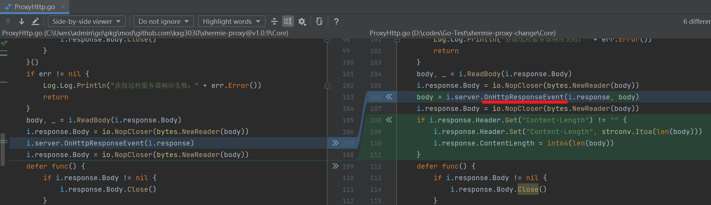

# proxy 代理

- [shermie-proxy-change](./shermie-proxy-change)是对[shermie-proxy](https://github.com/kxg3030/shermie-proxy)项目进行修改后的代码

主要修改了 OnHttpResponseEvent 的定义



配置文件定义如下

| CheckUrlType 值 | 意义 |
|----------------| -------- |
| 0              | 使用 lua 匹配|
| 1              | 包含 匹配|
| 2              | 开头匹配|
| 3              | 结尾匹配|
| 4              | 完全匹配|

| UpdateBodyType 值 | 意义 |
|------------------| -------- |
| 0                | 不修改 body|
| 1                | 使用 lua 修改 body|
| 2                | 追加、注入 body|
| 3                | 替换 body|

```javascript
const config = {
    "Port": "9090", // 代理端口
    "Nagle": true,
    "Proxy": "0",
    "Items": [
        {
            "ShowBody": false,
            "CheckUrlType": 2,
            "Url": "bak---http://zky.sass.elstp.cn/make/Field/Badminton/?",
            "UpdateBodyType": 2,
            "AppendOrReplaceBodyFromFile": false,
            "AppendOrReplaceBody": "<script>\n    window.fieldId = `ec640b11-140f-4377-2b56-3f6e011afec10\nec640b11-140f-4377-2b56-3f6e011afec11\nec640b11-140f-4377-2b56-3f6e011afec12\nec640b11-140f-4377-2b56-3f6e011afec13\nec640b11-140f-4377-2b56-3f6e011afec14\n`.split('\\n').map(_=>_.trim());\n\n    window.reqTime = 0;\n    $(function () {\n        $('.page__bd').before(`<div class=\"\" id=\"my_message\"></div>`)\n        $('#my_message').html(\"\");\n        // $('#my_message').append(`<textarea placeholder=\"订单备注\" id=\"remarks\" rows=\"3\" style=\"height: 20px;\"></textarea>`);\n        function showMsg(msg,name) {\n            name = name || '请求结果';\n            $('#my_message').append(\n                `<div className=\"weui-cell weui-cell_active\">\n                    <div className=\"weui-cell__hd\"><label className=\"weui-label\">${name}</label></div>\n                    <div className=\"weui-cell__bd\">\n                        <div className=\"weui-input\"><span style=\"color:white;background: black;\">${msg}</span></div>\n                    </div>\n                </div>`);\n        };\n        showMsg('开始',\"消息\");\n        window.alert = showMsg;\n        window.confirm = () => true;\n        var _ajax = $.ajax;\n        $.ajax = function (opt) {\n            // alert(JSON.stringify(opt));\n            showMsg('$.ajax',\"消息\");\n            _ajax({\n                ...opt,\n                data: {\n                    ...opt.data,\n                    field_id: window.fieldId[window.reqTime],\n                },\n                success(data) {\n                    if (data.code === 0) {\n                        showMsg(data.code,`请求成功了`);\n                    } else {\n                        showMsg(data.code,`第${window.reqTime}次请求`);\n                        nextTo();\n                    }\n                },\n                error() {\n                    showMsg(\"error-error\",`请求结束`);\n                }\n            });\n        };\n        function nextTo() {\n            showMsg('nextTo',\"消息\");\n            if (window.reqTime === window.fieldId.length) {\n                showMsg(\"全部尝试结束\",`主体部分`);\n            } else {\n                showMsg('nextTo-else',\"消息\");\n                setTimeout(() => {\n                    showMsg('nextTo-setTimeout',\"消息\");\n                    $('#btn').click();\n                    window.reqTime++;\n                },1000);\n            }\n        };\n        setTimeout(nextTo,1000);\n    });\n</script>"
        },
        {
            "ShowBody": true,
            "CheckUrlType": 2,
            "Url": "http://zky.sass.elstp.cn/make/Field/Badminton/?",
            "UpdateBodyType": 2,
            "AppendOrReplaceBodyFromFile": true,
            "AppendOrReplaceBody": "D:\\codes\\Go-Test\\goproxy\\zky.sass.elstp.cn.html"
        }
    ]
}
```
