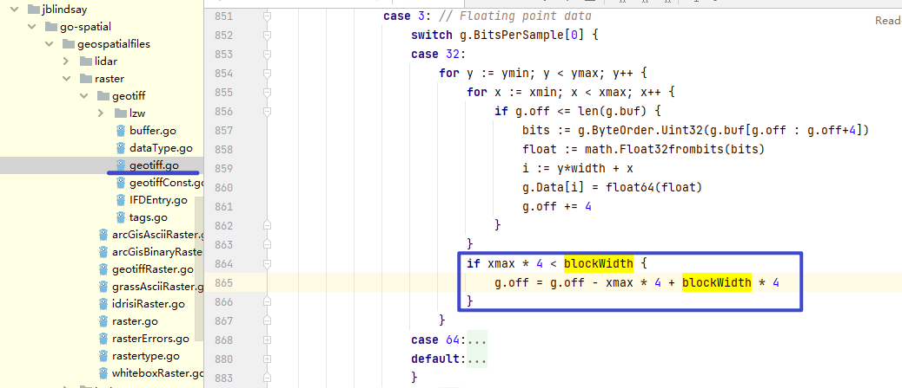

## tif 文件读写

- "github.com/jblindsay/go-spatial/geospatialfiles/raster/geotiff"

- 这个库有一个严重的bug，在某些特定的 geotiff 会出现读写数据偏移，需要修改源码



- 获取 tif 文件的 extent

```golang
type geotiffRasterHeader struct {
	rows     int
	columns  int
	numCells int
	cellSize float64
	north    float64
	south    float64
	east     float64
	west     float64
	xScale	 float64
	yScale	 float64
}
func createHeader(tif geotiff.GeoTIFF) geotiffRasterHeader {
	header := geotiffRasterHeader{}
	header.columns = int(tif.Columns)
	header.rows = int(tif.Rows)

	idf, err := tif.FindIFDEntryFromName("ModelPixelScaleTag")
	if err != nil { panic(err) }
	modelPixelScale, err := idf.InterpretDataAsFloat()
	if err != nil { panic(err) }
	idf, err = tif.FindIFDEntryFromName("ModelTiepointTag")
	if err != nil { panic(err) }
	modelTiepoint, err := idf.InterpretDataAsFloat()
	if err != nil { panic(err) }

	header.north = modelTiepoint[4] + modelTiepoint[1]*modelPixelScale[1]
	header.south = modelTiepoint[4] - (float64(header.rows)-modelTiepoint[1])*modelPixelScale[1]
	header.west = modelTiepoint[3] + (float64(header.columns)-modelTiepoint[0])*modelPixelScale[0]
	header.east = modelTiepoint[3] - modelTiepoint[0]*modelPixelScale[0]
	header.xScale = modelPixelScale[0]
	header.yScale = modelPixelScale[1]
	return header
}
```