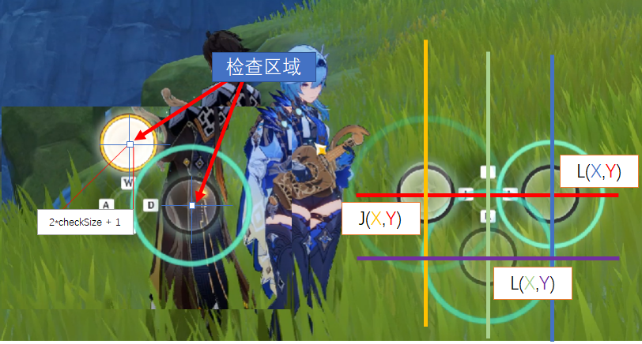

## 原神 镜花听世 代码

这个代码需要加入 [windows 窗口](./windows窗口.md) 和 [imageOp](./imageOp.md) 的代码，和安装 "github.com/go-vgo/robotgo"

- 核心代码

```go
package main

import (
	"fmt"
	"github.com/go-vgo/robotgo"
	"image/png"
	"os"
	"strconv"
	imageOP "xxxxxx\imageOp.go"
	"xxxxx\window.go"
)

var topX = 0
var topY = 0

// 这里表示要检查的范围，就是检查一个按键是否需要被按下，通常该位置会达到全白，需要检查的范围也就不需要太大
// 这里 2 表示的范围为 (2 * checkSize + 1) = 5 即大小为 5*5 的正方形内的像素
var checkSize = 2
 // 这里是指每一个字母对应的四角星与窗口右上角的相对位置（我没有全屏，因此这里要减去相对位置）
 // 这里是唯一需要根据应用修改的地方
var A = []int{470 - 187 - 67,724 - 154 - 64}
var D = []int{690 - 187 - 67,724 - 154 - 64}
var W = []int{580 - 187 - 67,612 - 154 - 64}
var S = []int{580 - 187 - 67,836 - 154 - 64}
var I = []int{1212- 187 - 67,612 - 154 - 64}
var J = []int{1099- 187 - 67,724 - 154 - 64}
var L = []int{1325- 187 - 67,724 - 154 - 64}
var K = []int{1212- 187 - 67,836 - 154 - 64}
var keyMap = map[string][]int {
	"a": A,
	"s": S,
	"d": D,
	"w": W,
	"j": J,
	"k": K,
	"l": L,
	"i": I,
}
// 查找窗口及位置
func findWindow() window.RECT {
	rect := window.RECT{}
	const title = "原神"
	m := window.GetAllWindows()
	//fmt.Printf("Map of windows: \n")
	fmt.Println("查找原神窗口")
	for handle := range m {
		//if strings.Contains(m[handle].Title(), title) {
		if title == m[handle].Title() {
			rect = window.GetWindowRect(handle)
			fmt.Printf("找到窗口：'%v'\n", m[handle])
			fmt.Print("窗口大小及位置：\t")
			fmt.Println(rect)
			topY = int(rect.Top)
			topX = int(rect.Left)
			break
		}
	}
	return rect
}
var eww = 230 * 3
func check(loc []int,oneList list)  {
	for {
		imgPath := oneList.key + ".jpg"
		shoot(loc,checkSize,imgPath)
		imgfile, err := os.Open(imgPath)
		if err != nil {
			panic(err)
		}
		defer imgfile.Close()
		img,err := png.Decode(imgfile)
		size := img.Bounds().Size()
		var s = 0
		for x := 0; x < size.X; x++ {
			for y := 0; y < size.Y; y++ {
				r, g, b, _ := img.At(x, y).RGBA()
				p := imageOP.RgbaToPixel(r,g,b,0)
				s = s + p.R + p.G + p.B - eww
			}
		}
		if s > 0 {
			if (oneList.del) {
				robotgo.KeyToggle(oneList.key,"down")
				robotgo.MilliSleep(oneList.delMillSecond)
				robotgo.KeyToggle(oneList.key,"up")
			} else {
				robotgo.KeyTap(oneList.key)
			}
			break
		}
	}
}
func shoot(loc []int,size int,imgPath string) {
	left := topX + loc[0] - size
	top := topY + loc[1] - size
	bitmap := robotgo.CaptureScreen(left,top,size * 2 + 1,size * 2)
	defer robotgo.FreeBitmap(bitmap)
	robotgo.SaveBitmap(bitmap, imgPath)
}

var menus = map[string]func()([]list) {
	"送故人归_1": 送故人归_1,
	"送故人归_2": 送故人归_2,
	"送故人归_3": 送故人归_3,
}
func main() {
	findWindow()
	fmt.Println("请选择要演奏的曲目")
	menusCopy := []string{}
	ind := 0
	selectMenuInd := 0

	for key,_ := range(menus) {
		fmt.Println(strconv.Itoa(ind) + "\t" + key)
		menusCopy = append(menusCopy,key)
		ind++
	}
	fmt.Scan(&selectMenuInd)
	for selectMenuInd < 0 && selectMenuInd >= ind {
		fmt.Println("只能选择 0 到 " + strconv.Itoa(ind) + " 之间的数字")
	}
	fmt.Println("鼠标移动到 重新演奏 处，按下 a 开始。")
	keyA := robotgo.AddEvent("a")
	if keyA {
		fmt.Println("开始")
		robotgo.MouseClick()
		执行队列(menus[menusCopy[selectMenuInd]]())
	}
}

func 执行队列(lists []list)  {
	fmt.Println("开始执行队列")
	ll := len(lists)
	for i := 0;i < ll;i++ {
		fmt.Println("当前准备字母为 [" + lists[i].key + "]")
		if len(lists[i].with) > 0 {
			for j := 0;j < len(lists[i].with);j++ {
				l := list{
					key: lists[i].with[j],
					del: false,
				}
				fmt.Println("当前同时检测字母 [" + l.key + "] (短按)")
				go check(keyMap[l.key],l)
			}
		}
		if len(lists[i].withTime) > 0 {
			for j := 0;j < len(lists[i].withTime);j++ {
				l := list{
					key: lists[i].withTime[j],
					del: true,
					delMillSecond: lists[i].delMillSecond,
				}
				fmt.Println("当前同时检测字母 [" + l.key + "] (长按)")
				go check(keyMap[l.key],l)
			}
		}
		check(keyMap[lists[i].key],lists[i])
	}
	fmt.Println("演奏结束")
}

type list struct {
	waitMillSecond int
	key string
	del bool
	delMillSecond int
	nop bool
	with []string
	withTime []string
}

// 添加按下
func addTapKey(key string) list {
	return list{
		waitMillSecond: 0,
		key: key,
		del: false,
		nop: false,
	}
}
// 添加长按
func addPressKey(key string,delMS int) list {
	return list{
		waitMillSecond: 0,
		key: key,
		del: true,
		delMillSecond: delMS,
		nop: false,
	}
}

// 送故人归 1
func 送故人归_1() (lists []list) {
	// 8.20 a
	// 9.25 d
	// 11.21 i 13.12
	// 14.29 l
	// 16.21 j
	// 18.15 w 20.09
	// 21.24 l
	// 23.11 k
	// 25.13 d 27.03
	// 28.18 a
	// 29.60 s
	// 32.08 j 33.28
	// 49.02 a
	// 50.26 w
	// 52.23 d 54.15
	// 56.05 j
	// 57.28 i 64.0
	// 64.00 j
	// 65.13 d 71.21
	lists = []list {
		addTapKey("a"),
		addTapKey("d"),
		addPressKey("i",1920),
		addTapKey("l"),
		addTapKey("j"),
		addPressKey("w",1960),
		addTapKey("l"),
		addTapKey("k"),
		addPressKey("d",1900),
		addTapKey("a"),
		addTapKey("s"),
		addPressKey("j",1200),
		addTapKey("a"),
		addTapKey("w"),
		addPressKey("d",1920),
		addTapKey("j"),
		addPressKey("i",6719),
		addTapKey("j"),
		addPressKey("d",6079),
	}
	return
}
func 送故人归_2() (lists []list) {
	/*
	l
	k
	j
	12.20 a 14.10
	w
	a
	s
	d
	19.16 j 21.09
	l
	k
	j
	26.14 d 28.04
	#a
	s
	d
	j
	33.07 l 35.50
	a
	w
	d
	53.24 i 55.13
	l
	k
	58.24 d 64.29
	#k
	66.14 j 12.22
	*/
	lists = []list {
		addTapKey("l"),
		addTapKey("k"),
		addTapKey("j"),
		addPressKey("a",1900),
		addTapKey("w"),
		addTapKey("a"),
		addTapKey("s"),
		addTapKey("d"),
		addPressKey("j",1929),
		addTapKey("l"),
		addTapKey("k"),
		addTapKey("j"),
		addPressKey("d",1899),
		addTapKey("s"),
		addTapKey("d"),
		addTapKey("j"),
		addPressKey("l",2429),
		addTapKey("a"),
		addTapKey("w"),
		addTapKey("d"),
		addPressKey("i",1890),
		addTapKey("l"),
		addTapKey("k"),
		addPressKey("d",6050),
		addPressKey("j",-53920),
	}
	lists[12].with = append(lists[12].with,"a")
	lists[24].with = append(lists[24].with,"k")
	return
}
func 送故人归_3() (lists []list) {
	/*
	s
	a
	w
	9.26 j 11.19
	#d
	l
	k
	j
	d
	s
	16.21 i 18.15
	#a
	w
	d
	j
	23.16 l 25.10
	$a
	#i
	d
	s
	a
	j
	k
	30.09 i 32
	$w
	#l
	47.14 a 48.11
	$w
	$d
	#j
	50.29 l 52.19
	a
	d
	j
	l
	56.01 w 62.03
	$i
	#s
	#k
	63.17 d 69.24
	$j
	*/
	lists = []list {
		addTapKey("s"),
		addTapKey("a"),
		addTapKey("w"),
		addPressKey("j",1930),
		addTapKey("l"),
		addTapKey("k"),
		addTapKey("j"),
		addTapKey("d"),
		addTapKey("s"),
		addPressKey("i",1930),
		addTapKey("w"),
		addTapKey("d"),
		addTapKey("j"),
		addPressKey("l",1940),
		addTapKey("d"),
		addTapKey("s"),
		addTapKey("a"),
		addTapKey("j"),
		addTapKey("k"),
		addPressKey("i",1910),
		addPressKey("a",969),
		addPressKey("l",1899),
		addTapKey("a"),
		addTapKey("d"),
		addTapKey("j"),
		addTapKey("l"),
		addPressKey("w",6100),
		addPressKey("d",6100),
	}
	lists[3].with = append(lists[3].with,"d")
	lists[9].with = append(lists[9].with,"a")
	lists[13].withTime = append(lists[13].withTime,"a")
	lists[13].with = append(lists[13].with,"i")
	lists[19].withTime = append(lists[19].withTime,"w")
	lists[19].with = append(lists[19].with,"l")
	lists[20].withTime = append(lists[20].withTime,"w")
	lists[20].withTime = append(lists[20].withTime,"d")
	lists[20].with = append(lists[20].with,"j")
	lists[26].withTime = append(lists[26].withTime,"i")
	lists[26].with = append(lists[26].with,"s")
	lists[26].with = append(lists[26].with,"k")
	lists[27].withTime = append(lists[27].withTime,"j")
	return
}
```

- 按键序列转 go 代码

```javascript
// 按键序列的编写规则是
// ① 一行表示一个按键的监听
// ② 行存在顺序关系
//      例如需要依次按下 asdasd
//      不能携程 a a s s d d
// ③ 只有一个字母时表示需要短按一个字母
// ④ 如果格式为 [数字 字母 数字] 例如 [09.26 j 11.19]
//      表示 j 按键是一个需要按下一段事件的按键，按下时间长度为 11.19-09.26 秒
//          首尾数字仅用来计算时长
// ⑤ 如果多个按键有可能要同时按下，可以在第二个按键使用 # 或 $
//      例如 10 w 20
//           $i
//           #a
//      这个例子表示，w 和 i 和 a 可能会存在时间重叠部分，需要同时去监听
//      另外还表示 w 和 i 都是需要按下时间长度为 (20-10) s 的按键
//      而 a 只需要简单按下即可

let timeList = `s
	a
	w
	09.26 j 11.19
	#d
	l
	k
	j
	d
	s
	16.21 i 1815
	#a
	w
	d
	j
	23.16 l 25.10
	$a
	#i
	d
	s
	a
	j
	k
	30.09 i 32
	$w
	#l
	47.14 a 48.11
	$w
	$d
	#j
	50.29 l 52.19
	a
	d
	j
	l
	56.01 w 62.03
	$i
	#s
	#k
	63.17 d 9.24
	$j`;

let goLang = () => {
    let withArr = [];
    let lastOneIndex = -1;
    let all = [].concat(...timeList.split('\n').map(_ => _.trim().split(" ")).map((l,ind) => {
        let ret = [];
        if (l.length === 3) {
            ret.push(`addPressKey("${l[1]}",${parseInt((l[2] - l[0]) * 1000)})`);
            lastOneIndex++;
        } else {
            if (l.length === 1) {
                if (l[0][0] === '#') {
                    // ret.push(`addNop("${l[0].trim()}")`)
                    withArr.push(`lists[${lastOneIndex}].with = append(lists[${lastOneIndex}].with,"${l[0][1].trim()}")`);
                } else if (l[0][0] === '$') {
                    // ret.push(`addNop("${l[0].trim()}")`)
                    withArr.push(`lists[${lastOneIndex}].withTime = append(lists[${lastOneIndex}].withTime,"${l[0][1].trim()}")`);
                } else {
                    ret.push(`addTapKey("${l[0].trim()}")`);
                    lastOneIndex++;
                }
            } else {
                ret.push(`addTapKey("${l[0].trim()}")`);
                lastOneIndex++;
            }
        }
        return ret;
    }));
    console.log(`lists = []list {\r\n` + all.join(',\r\n') + `,\r\n}\r\n${withArr.join('\r\n')}`);
};
goLang()
```

- 原理图如下

