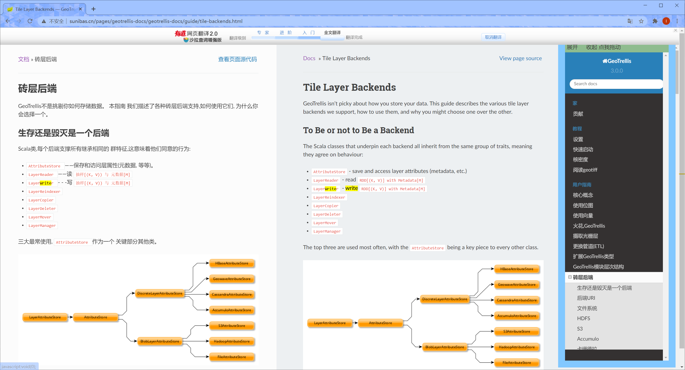
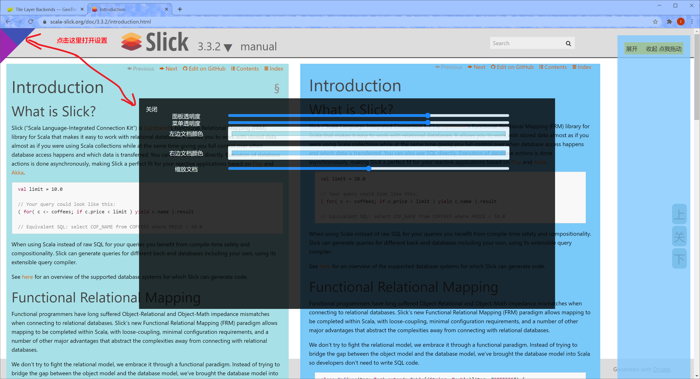
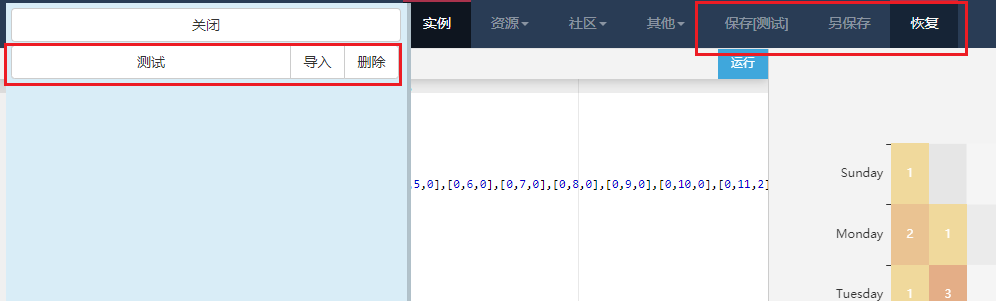

- [谷歌翻译换行](https://greasyfork.org/zh-CN/scripts/413066-%E8%B0%B7%E6%AD%8C%E7%BF%BB%E8%AF%91%E6%8D%A2%E8%A1%8C)

可以将谷歌翻译输入框中的换行自动合并为一行
设用于 pdf 直接复制过来翻译的文本

- 标记[可转债](http://data.eastmoney.com/kzz/default.html)是否盈利[插件](https://greasyfork.org/zh-CN/scripts/413607-%E6%A0%87%E8%AE%B0%E5%8F%AF%E8%BD%AC%E5%80%BA%E6%98%AF%E5%90%A6%E7%9B%88%E5%88%A9)

标记可转债是否盈利

- [READTHEDOCS.IO](https://greasyfork.org/zh-CN/scripts/404075-readthedocs-io)

geotrilles 类型文档分频显示后可以开启有道翻译
支持文档配色
支持菜单透明
支持文档缩放
支持 slick 3.0 以上的不同版本（目前支持到3.3.0）





- [为 echart 编辑器添加缓存工具](https://greasyfork.org/zh-CN/scripts/414739-%E4%B8%BA-echart-%E7%BC%96%E8%BE%91%E5%99%A8%E6%B7%BB%E5%8A%A0%E7%BC%93%E5%AD%98%E5%B7%A5%E5%85%B7)

```保存按钮``` 如果有名字，表示将当前代码覆盖到对应名字的缓存中

```另保存按钮``` 可以将代码保存到另一个名字中



- 哔哩哔哩倍数全屏快捷键

