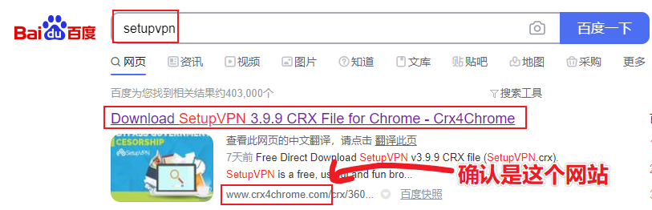
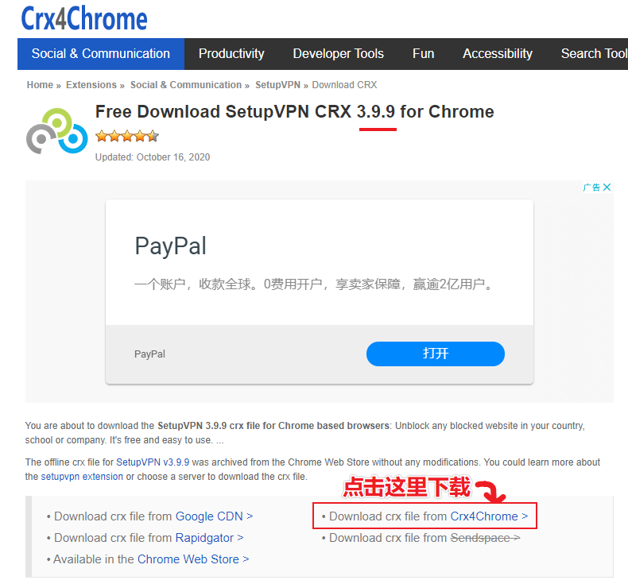
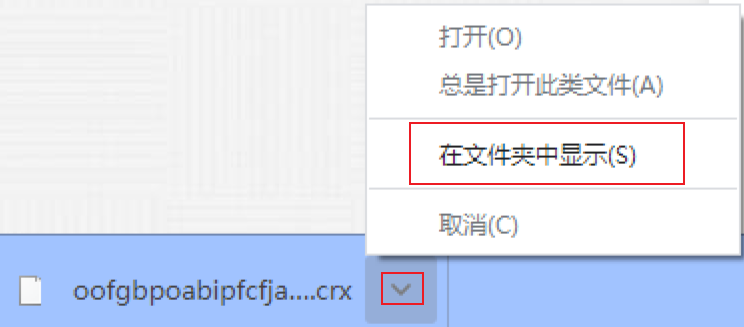
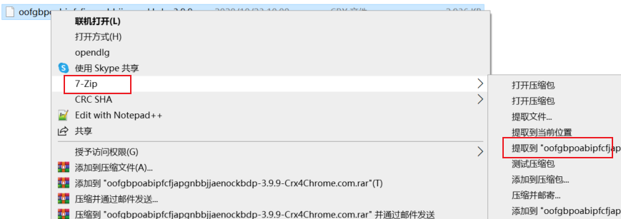
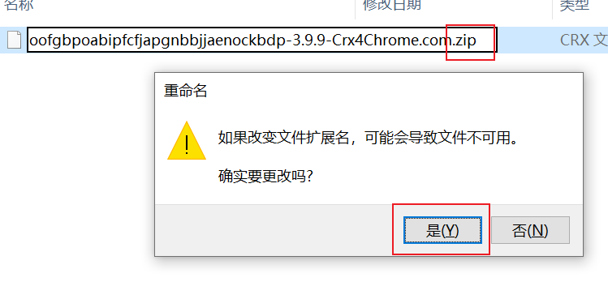
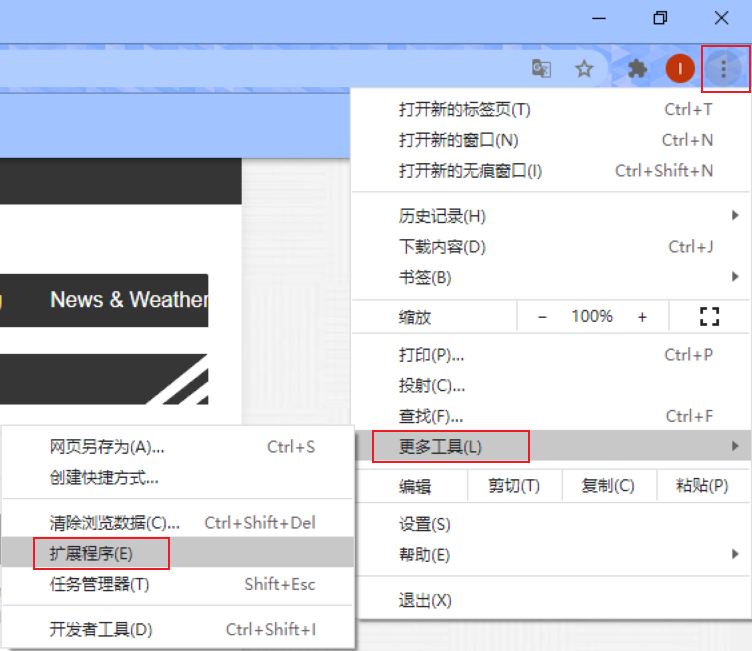
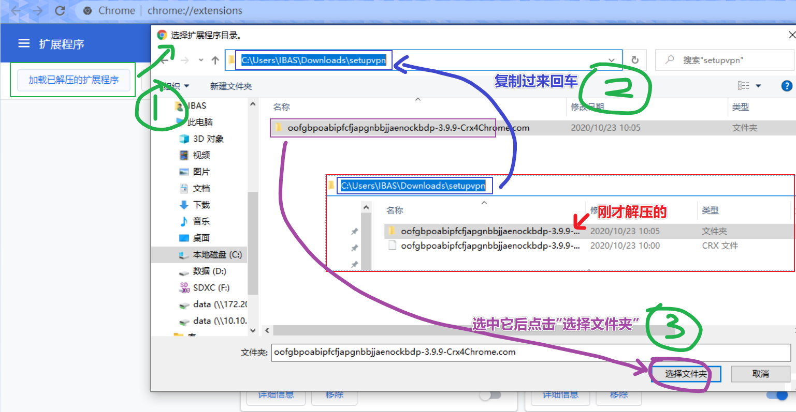

1. 浏览器搜索 setupvpn （注意不要找错位置）

2. 下载（注意版本）

3. 如果提示不安全，确认下载

4. 打开文件夹

5. 解压

如果没有看到解压工具，试一下改一下后缀

6. 进入扩展中心

7. 将解压的扩展加入

8. 如果很在意打开浏览器时的提示，打开扩展中心[进行安装](https://chrome.google.com/webstore/search/setupvpn?hl=zh-CN)

