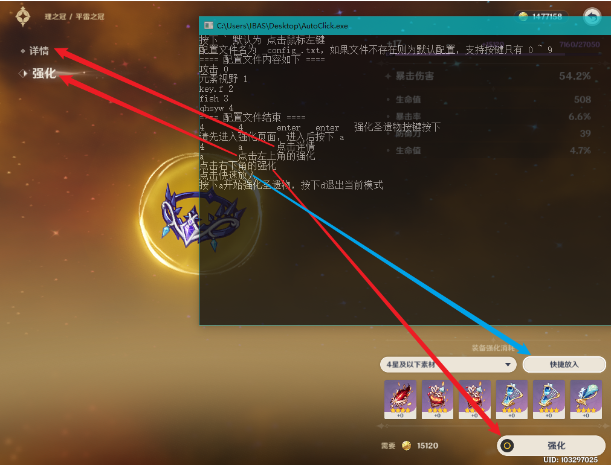
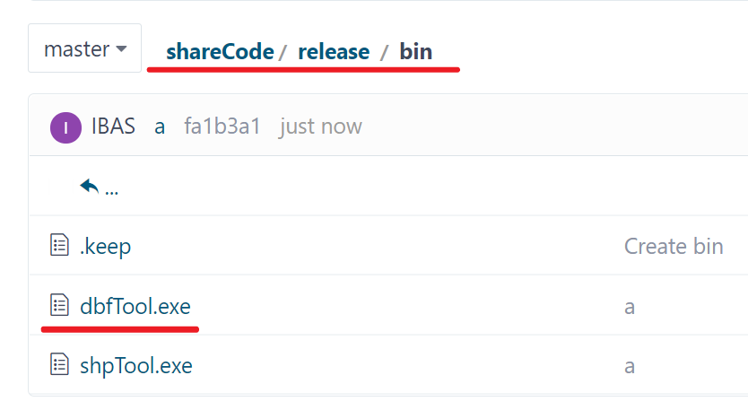
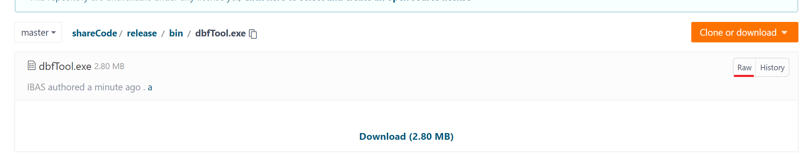

打包好的可执行文件，及其使用说明

#### autoClick 元神操作辅助工具



#### dbfTool 一个 arcgis 的 dbf 文件小工具

```text
1. 将 dbf 文件转为 JSON 文件
dbfTool.exe json dbfFile jsonFile
2. 将 dbf 内容直接展示出来
dbfTool.exe view dbfFile
>>>dbfTool.exe view D:\tmp\dbfs\2000-l7.tif.vat.dbf
>>>        Value: 1                Count: 255884
>>>        Value: 2                Count: 3.2809354e+07
```

#### shpTool 一个 shp 和 geojson 互转的工具

```text
将 shp 转为 geojson
shpTool.exe json shp_path geojson_path
>>> shpTool.exe json a.shp a.json
将 geojson 转为 shp
        arcigs = True/False 表示是否为 arcgis 导出的 geojson
        web = True/False 表示是否为 arcgis 在线导出的 geojson
    arcgis 导出的 和 arcgis 在线网站导出的 json 是不一样的
    使用本工具转出的 json ，直接执行
        shpTool.exe shp 转出的json 输出的shp false false
shpTool.exe shp geojson_path shp_path arcigs web
>>> shpTool.exe shp arcgis_web.json arcgis_web.shp true true
>>> shpTool.exe shp arcgis.json arcgis_web.shp true false
```

将 json 转 shp 只支持 point line polygon 三种类型（multi 类型的就不支持了）

```go
func convertGeoJson2Shp(fc * geojson.FeatureCollection,shpFile string) {
	var err error
	geometryType := fc.Features[0].Geometry.Type
	if err != nil {
		panic(err)
	}
	if len(fc.Features) == 0 {
		fmt.Println("不创建空矢量")
		return
	}
	var shpWriter * Utils.Writer
	var geojson2shpMetod func(writer * Utils.Writer,fets []*geojson.Feature)

	if geometryType == geojson.GeometryPoint {
		shpWriter,err = Utils.Create(shpFile,Utils.POINT)
		geojson2shpMetod = geoJson2ShpPoints
	} else if geometryType == geojson.GeometryLineString {
		shpWriter,err = Utils.Create(shpFile,Utils.POLYLINE)
		geojson2shpMetod = geoJson2ShpPolyline
	} else if geometryType == geojson.GeometryPolygon {
		shpWriter,err = Utils.Create(shpFile,Utils.POLYGON)
		geojson2shpMetod = geoJson2ShpPolygon
	}
	if err != nil {
		panic(err)
	}
	geojson2shpMetod(shpWriter,fc.Features)
	defer shpWriter.Close()
}
```

#### excel 工具

```text
将(文件夹下的)文件转为json并存放到源文件的所在文件夹中
                exe json file/dir
                例如将 c 盘下的 a.xlsx 文件转为 a.json 文件
                        exe json c:\a.xlsx
                例如将 c 盘下的 xlsx 文件夹下的所有 xlsx 文件转为 json 文件
                        exe json c:\xlsx
```

#### extract 多值提取到点 （对应于 arcgis 软件的同个功能）

```text
使用方法为，写个配置文件，例如内容如下
----------内容开始--------------
i:D:\tmp\test\in.shp
o:D:\tmp\test\out.shp
t:D:\tmp\test\a.tif
n:a
t:D:\tmp\test\b.tif
n:b
----------内容结束--------------
上面内容表示 使用 i 作为输入[点]矢量，将 a.tif b.tif 对应的值提取到 in.shp 中且对应字段为 a b，最后生成 out.shp
这里要求使用的 shp 和 tif 文件的投影必须是一致的
```

#### 文件下载方法

1.点击要下载的文件



2.点击 raw 进行下载


