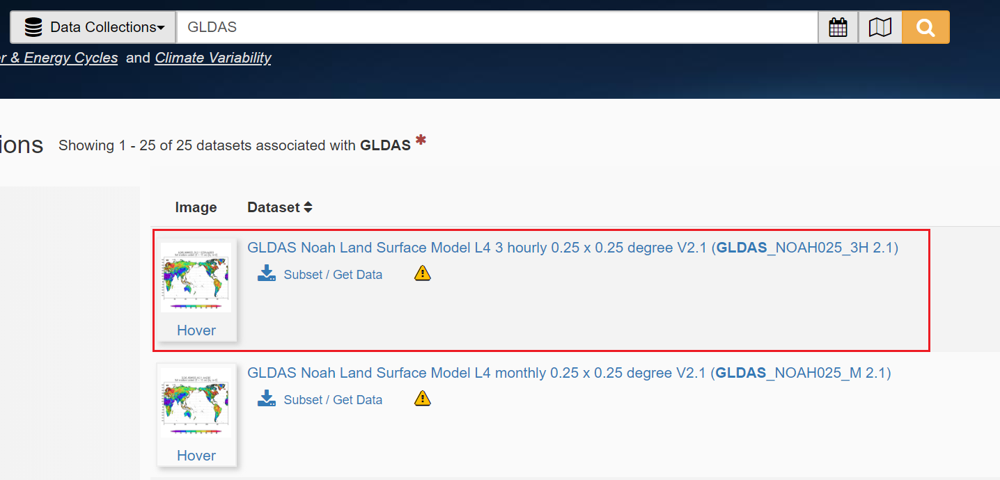
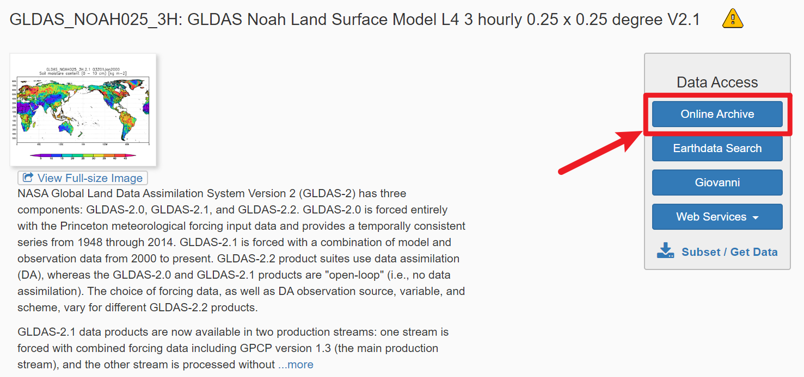
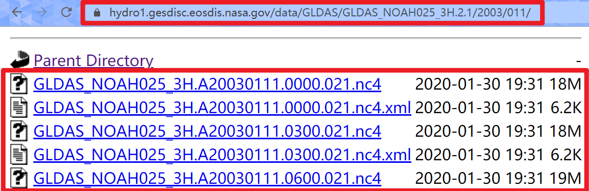
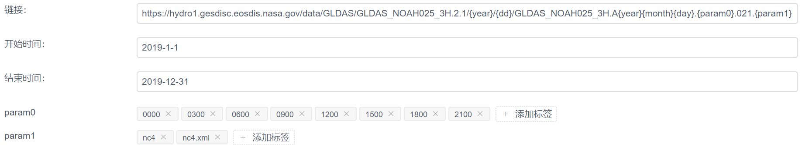
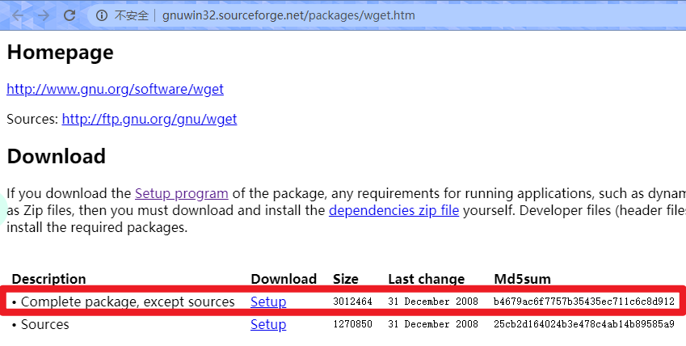

### GES DISC 文件下载

下载 [GES DISC](https://disc.gsfc.nasa.gov/datasets) 网站的遥感影像数据

1. 筛选数据



2. 进入选中的数据，点击右方的 ```Online Archive```



3. 随机进入到某一年份的最底层，可以看到文件名和大小，这里进入了 ```2003/011```



- 上面内容表单填写方例子如下



- 如果电脑中没有 [wget](http://gnuwin32.sourceforge.net/packages/wget.htm) 如下图下载安装

