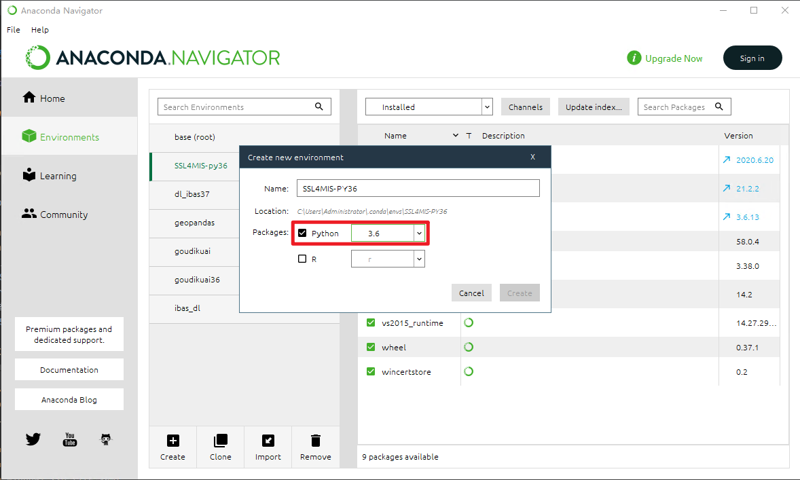

## 1.下载项目

[半监督学习医学图像分割](https://github.com/HiLab-git/SSL4MIS)

## 2.下载cuda11.6并安装

[cuda11.6](https://developer.download.nvidia.cn/compute/cuda/11.6.1/local_installers/cuda_11.6.1_511.65_windows.exe)

3.创建一个新的 python环境



## 4.导入项目到 pycharm 中

## 5.下载带 cuda 的 torch、torchvision

- [torch-1.10.0%2Bcu113-cp36-cp36m-win_amd64.whl](https://download.pytorch.org/whl/cu113/torch-1.10.0%2Bcu113-cp36-cp36m-win_amd64.whl)

- [torchaudio-0.10.0%2Bcu113-cp36-cp36m-win_amd64.whl](https://download.pytorch.org/whl/cu113/torchaudio-0.10.0%2Bcu113-cp36-cp36m-win_amd64.whl)

## 6.下载项目中提及的文件并解压到对应位置（看 readme.md）

[ACDC](./data/ACDC/README.md) 和 [BraTS2019](./data/BraTS2019/README.md)

## 7.配置 pycharm 的 python 环境


# 8.根据readme安装 依赖

```text
pytorch & torchvision (第 5 中已经下载好，安装)
tqdm
tensorboardX
scikit-image  // ModuleNotFoundError: No module named 'skimage'
opencv-python // ModuleNotFoundError: No module named 'cv2'
h5py // ModuleNotFoundError: No module named 'h5py'
efficientnet_pytorch
einops // ModuleNotFoundError: No module named 'einops'
timm // ModuleNotFoundError: No module named 'timm'
pyyaml // ModuleNotFoundError: No module named 'yaml'
yacs // ModuleNotFoundError: No module named 'yacs'
batchgenerators // ModuleNotFoundError: No module named 'batchgenerators'
medpy // ModuleNotFoundError: No module named 'medpy'

requirement.txt 可以如下
torch==1.10.0+cu113
torchvision==0.11.0+cu113
tqdm==4.63.0
tensorboardX==2.5
scikit-image==0.17.2
opencv-python==4.5.5.64
h5py==3.1.0
efficientnet_pytorch==0.7.1
einops==0.4.1
timm==0.5.4
pyyaml==6.0
yacs==0.1.8
batchgenerators==0.23
medpy==0.4.0
```

# 9.代码修改

- 将 ```worker_init_fn``` 修改为全局，（global 语法可能是可行的）

- 将 ```num_workers``` 改小，暂时不知道代码中是如何换算到对应的存储大小的，但是 16 时会显示 页 不足。

## 10.开始运行diamond

- 阅读 [readme](./code/README.md)

训练模型 ```python train_XXXXX_3D.py or python train_XXXXX_2D.py```，下面是可用于训练的模型

-[train_adversarial_network_2D.py](./code/train_adversarial_network_2D.py)

-[train_adversarial_network_3D.py](./code/train_adversarial_network_3D.py)

-[train_cross_consistency_training_2D.py](./code/train_cross_consistency_training_2D.py)

-[train_cross_pseudo_supervision_2D.py](./code/train_cross_pseudo_supervision_2D.py)

-[train_cross_pseudo_supervision_3D.py](./code/train_cross_pseudo_supervision_3D.py)

-[train_cross_teaching_between_cnn_transformer_2D.py](./code/train_cross_teaching_between_cnn_transformer_2D.py)

-[train_deep_co_training_2D.py](./code/train_deep_co_training_2D.py)

-[train_entropy_minimization_2D.py](./code/train_entropy_minimization_2D.py)

-[train_entropy_minimization_3D.py](./code/train_entropy_minimization_3D.py)

-[train_fully_supervised_2D.py](./code/train_fully_supervised_2D.py)

-[train_fully_supervised_3D.py](./code/train_fully_supervised_3D.py)

-[train_interpolation_consistency_training_2D.py](./code/train_interpolation_consistency_training_2D.py)

-[train_interpolation_consistency_training_3D.py](./code/train_interpolation_consistency_training_3D.py)

-[train_mean_teacher_2D.py](./code/train_mean_teacher_2D.py)

-[train_mean_teacher_3D.py](./code/train_mean_teacher_3D.py)

-[train_uncertainty_aware_mean_teacher_2D.py](./code/train_uncertainty_aware_mean_teacher_2D.py)

-[train_uncertainty_aware_mean_teacher_3D.py](./code/train_uncertainty_aware_mean_teacher_3D.py)

-[train_uncertainty_rectified_pyramid_consistency_2D.py](./code/train_uncertainty_rectified_pyramid_consistency_2D.py)

-[train_uncertainty_rectified_pyramid_consistency_3D.py](./code/train_uncertainty_rectified_pyramid_consistency_3D.py)

测试模型 ```python test_XXXXX.py```

-[test_2D_fully.py](./code/test_2D_fully.py)

-[test_3D.py](./code/test_3D.py)

-[test_3D_util.py](./code/test_3D_util.py)

-[test_acdc_unet_semi_seg.sh](./code/test_acdc_unet_semi_seg.sh)

-[test_brats2019_semi_seg.sh](./code/test_brats2019_semi_seg.sh)

-[test_urpc.py](./code/test_urpc.py)

-[test_urpc_util.py](./code/test_urpc_util.py)