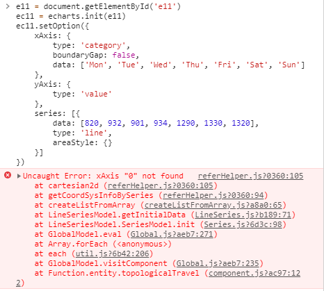

vue serve 模式下使用 echarts 方法

```js
// npm i echarts --save
    import * as echarts from 'echarts/lib/echarts'
    import "echarts/lib/chart/line"
    import "echarts/lib/component/toolbox"
    import "echarts/lib/component/tooltip"
    import "echarts/lib/component/legend"
    import "echarts/lib/component/legendScroll"
    import "echarts/lib/component/singleAxis"
    import 'echarts/lib/component/grid';

```

>> 问题一： xAxis 0 not found



添加 ```import 'echarts/lib/component/grid';```